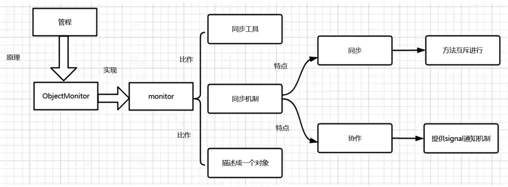
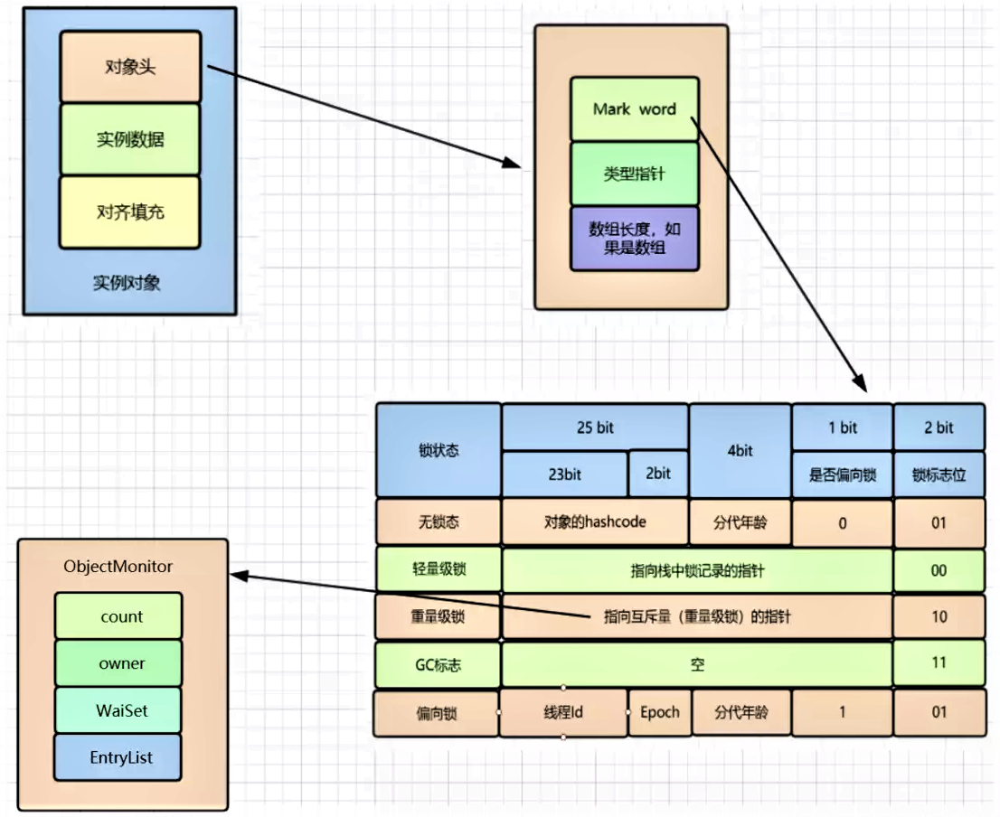
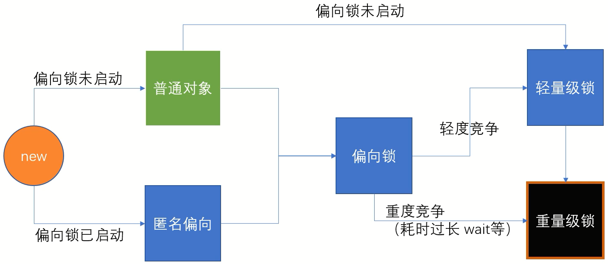

# Java 锁机制

### 概览

- syncronized 锁升级过程
- ReentrantLock 可重入锁
- volatile 关键字
- JUC 包下新的同步机制


## syncronized

给一个变量/一段代码加锁，线程拿到锁之后，才能修改一个变量/执行一段代码

- `wait()`
- `notify()`

synchronized 关键字可以作用于 **方法** 或者 **代码块**，最主要有以下几种使用方式：


注意：

1. 不要用 String 类型的常量作为锁（两个不同的变量，指向相同的String常量，作为锁的时候，可能造成冲突）
2. 不要用 Integer，Long 类型的变量作为锁（内部做了特殊处理，改变其值时，可能会变成新对象）

#### syncronized 实现原理？

```java
Object o = new Object();
synchronized (o) {}
```

添加 synchronized 之后，生成的字节码：

```asm
 0 new #2 <java/lang/Object>
 3 dup
 4 invokespecial #1 <java/lang/Object.<init>>
 7 astore_1
 8 aload_1
 9 dup
10 astore_2
11 monitorenter // 获取锁
12 aload_2
13 monitorexit // 释放锁
14 goto 22 (+8)
17 astore_3
18 aload_2
19 monitorexit // 兜底：如果发生异常，自动释放锁
20 aload_3
21 athrow
22 return
```

##### 1、字节码层面：ACC_SYNCHRONIZED，monitorenter，monitorexit（重量级锁）

事实上，只有在JDK1.6之前，synchronized的实现才会直接调用ObjectMonitor的enter和exit，这种锁被称之为重量级锁。从JDK6开始，HotSpot虚拟机开发团队对Java中的锁进行优化，如增加了适应性自旋、锁消除、锁粗化、轻量级锁和偏向锁等优化策略。

https://juejin.im/post/6844903918653145102

- ##### ACC_SYNCHRONIZED：把 syncronized 加在方法上时的字节码

  方法调用时，调用指令将会检查方法的 ACC_SYNCHRONIZED 访问标志是否被设置，如果设置了，执行线程将先持有 monitor（虚拟机规范中用的是管程一词），然后再执行方法，最后再方法完成(无论是正常完成还是非正常完成)时释放monitor

  > ##### ACC_SYNCHRONIZED：
  >
  > 方法级别的同步是隐式的，作为方法调用的一部分。同步方法的常量池中会有一个ACC_SYNCHRONIZED标志。
  > 当调用一个设置了ACC_SYNCHRONIZED标志的方法，执行线程需要先获得monitor锁，然后开始执行方法，方法执行之后再释放monitor锁，当方法不管是正常return还是抛出异常都会释放对应的monitor锁。
  > 在这期间，如果其他线程来请求执行方法，会因为无法获得监视器锁而被阻断住。
  > 如果在方法执行过程中，发生了异常，并且方法内部并没有处理该异常，那么在异常被抛到方法外面之前监视器锁会被自动释放。

- ##### monitorenter, monitorexit：把 syncronized 用于对象时的字节码

  代码块的同步是利用 monitorenter 和 monitorexit 这两个字节码指令。它们分别位于同步代码块的开始和结束位置。当 jvm 执行到 monitorenter 指令时，当前线程试图获取 monitor 对象的所有权

  - 如果未加锁或者已经被当前线程所持有，把锁计数器 +1
  - 当执行 monitorexit 指令时，锁计数器 -1
  - 当锁计数器为 0 时，锁被释放
  - 如果获取monitor对象失败，该线程进入阻塞状态，直到其他线程释放锁。

  
> ##### monitorenter：
  >
  > 每个对象都与一个 monitor 相关联。当且仅当拥有所有者时（被拥有），monitor才会被锁定。执行到monitorenter指令的线程，会尝试去获得对应的monitor，如下：
  >
  > 每个对象维护着一个记录着被锁次数的计数器, 对象未被锁定时，该计数器为0。线程进入monitor（执行monitorenter指令）时，会把计数器设置为1.
  > 当同一个线程再次获得该对象的锁的时候，计数器再次自增.
  > 当其他线程想获得该monitor的时候，就会阻塞，直到计数器为0才能成功。
  >
  > ##### monitorexit：
  >
  > monitor的拥有者线程才能执行 monitorexit指令。
  >
  > 线程执行monitorexit指令，就会让monitor的计数器减一。如果计数器为0，表明该线程不再拥有monitor。其他线程就允许尝试去获得该monitor了。

- monitor 监视器

  monitor是什么？ 它可以理解为一种同步工具，或者说是同步机制，它通常被描述成一个对象。**操作系统的管程** 是概念原理，在 HotSpot 中，Monitor（管程）是由 ObjectMonitor 实现的。

  

  Java Monitor 的工作机理如图所示：

  

  对象是如何跟 monitor关联的呢？直接看图：

  

  对象里有对象头，对象头里面有Mark Word，Mark Word 指针指向了 monitor

##### 2、JVM 层面

-  C, C++ 调用了操作系统提供的同步机制，在 win 和 linux 上不同

##### 3、OS 和硬件层面

- X86 : `lock cmpxchg` / xxx
- lock 是处理多处理器之间的总线锁问题


### syncronized 锁升级过程

早期（jdk 1.2 以前）所有的 syncronized 都是重量级锁，由操作系统管理。后来进行了优化，锁升级过程。

偏向锁、自旋锁都是用户空间完成，JVM自己管理；重量级锁需要向内核申请



markword 组成


#### 偏向锁

- 普通对象加了 syncronized，会加上偏向锁。偏向锁默认是打开的，但是有一个时延，如果要观察到偏向锁，应该设定参数

- 我们知道，Vector，StringBuffer 都有很多使用了 syncronized 的同步方法，但是在工业实践中，我们通常是在单线程的时候使用它的，**没有必要 **设计 **锁竞争机制**。

  为了在没有竞争的情况下减少锁开销，偏向锁偏向于第一个获得它的线程，**把第一个访问的 线程 id 写到 markword 中**，而不去真正加锁。如果一直没有被其他线程竞争，则持有偏向锁的线程将不需要进行同步

  默认情况，偏向锁有个时延，默认是4秒。why? 因为JVM虚拟机自己有一些默认启动的线程，里面有好多sync代码，这些sync代码启动时就知道肯定会有竞争，如果使用偏向锁，就会造成偏向锁不断的进行锁撤销和锁升级的操作，效率较低。

  ```shell
  -XX:+UseBiasedLocking -XX:BiasedLockingStartupDelay=0
  ```

  设定上述参数，new Object () - > 101 偏向锁 -> 线程ID为0 -> 匿名偏向 Anonymous BiasedLock ，指还没有偏向任何一个线程。打开偏向锁，new出来的对象，默认就是一个可偏向匿名对象 101（或者 sleep 5000 之后再打印也可以看到偏向锁）


#### 轻量级锁（也叫 自旋锁 / 无锁 / CAS）

- 偏向锁时，有人来竞争锁，操作系统把 **偏向锁撤销**，进行 **自旋锁（轻量级锁）竞争**。

- 在没有竞争的前提下，减少 **重量级锁使用操作系统 mutex 互斥量** 产生的性能消耗

  虚拟机在当前线程的栈帧中建立一个 **锁记录 (Lock Record, LR) **空间，存储锁对象目前 markword 的拷贝。

  虚拟机 **使用 CAS 尝试把对象的 markword 更新为指向 LR 的指针**，如果更新成功即代表该线程拥有了锁，锁标志位将转变为 00，表示处于轻量级锁定状态。

- CAS 是一种乐观锁：`cas(v, a, b)` 变量v，期待a，修改值b

- Java 中调用了 native 的 `conpareAndSwapXXX()` 方法

- 每个人在自己的线程内部生成一个自己LR（Lock Record锁记录），两个线程通过自己的方式尝试将 LR 写门上，竞争成功的开始运行，竞争失败的一直自旋等待。

- 实际上是汇编指令 `lock cmpxchg`，硬件层面实现：在操作过程中不允许被其他CPU打断，避免CAS在写数据的时候被其他线程打断，相比操作系统级别的锁，效率要高很多。

  > `LOCK` 本身不是一个指令：它是一个指令前缀，该指令必须是对存储器（ INC, XCHG, CMPXCHG等）进行 读 – 修改 – 写操作的指令，在这种情况下，它是在所保存的地址处包含字的`incl (%ecx)`指令在`ecx`寄存器中。
  >
  > `LOCK` 前缀确保CPU在操作期间拥有适当的caching行的独占所有权，并提供某些额外的订购保证。 这可以通过声明一个总线锁来实现，但是CPU将尽可能地避免这种情况。
  >
  > CPU在执行cmpxchg指令之前会执行lock锁定总线,实际是锁定北桥信号。现在的主板貌似没有南北桥了，集成到cpu里面了 http://www.360doc.com/content/18/0216/10/44130189_730197818.shtml

 - 如何解决ABA问题？

   - 基础数据类型即使出现了ABA，一般问题不大。
   - 解决方式：加版本号，后面检查的时候连版本号一起检查。
   - Atomic里面有个带版本号的类 `AtomicStampedReference`，目前还没有人在面试的时候遇到过。

- 线程始终得不到锁会自旋消耗 CPU


#### 重量级锁

- 轻量级锁再竞争，升级为重量级锁
  - 重量级锁向 **Linux 内核** 申请锁 mutex， CPU从3级-0级系统调用，线程挂起，进入等待队列，等待操作系统的调度，然后再映射回用户空间。他有一个等待队列，不需要 CAS 消耗 CPU 时间。
- 在 markword 中记录 ObjectMonitor，是 JVM 用 C++ 写的一个 Object


#### 自旋锁，什么时候升级为重量级锁？

竞争加剧：有线程超过10次自旋， -XX:PreBlockSpin， 或者自旋线程数超过CPU核数的一半， 1.6之后，加入自适应自旋 Adapative Self Spinning ， JVM自己控制自旋次数，不需要你设置参数了。所以你在做实验的时候，会发现有时候 syncronized 并不比 AtomicInteger 效率低。

升级重量级锁：-> 向操作系统申请资源，linux mutex , CPU从3级-0级系统调用，线程挂起，进入等待队列，等待操作系统的调度，然后再映射回用户空间


#### 为什么有自旋锁，还需要重量级锁？

自旋是消耗CPU资源的，如果锁的时间长，或者自旋线程多，CPU会被大量消耗

重量级锁有等待队列，所有拿不到锁的进入等待队列，不需要消耗CPU资源


#### 偏向锁，是否一定比自旋锁效率高？

不一定，在明确知道会有多线程竞争的情况下，偏向锁肯定会涉及锁撤销，这时候直接使用自旋锁

例如，JVM 启动过程，会有很多线程竞争（明确知道，比如在刚启动的之后，肯定有很多线程要争抢内存的位置），所以，默认情况启动时不打开偏向锁，过一段儿时间再打开。


#### 锁重入

sychronized是可重入锁

重入次数必须记录，因为要解锁几次必须得对应

偏向锁、自旋锁，重入次数存放在线程栈，让 LR + 1

重量级锁 -> ? ObjectMonitor 字段上

**如果计算过对象的 hashCode，则对象无法进入偏向状态！**

> 轻量级锁重量级锁的hashCode存在与什么地方？
>
> 答案：线程栈中，轻量级锁的LR中，或是代表重量级锁的ObjectMonitor的成员中


## ReentrantLock 可重入锁

### ReentrantLock 的使用

ReentrantLock 和 synchronized 都是可重入锁，Reentrantlock 可以完成 synchronized 同样的功能：由于 m1 锁定 this，只有 m1 执行完毕的时候，m2 才能执行。

- 使用 Reentrantlock，可以进行 tryLock “尝试锁定”，这样如果无法锁定，或者在指定时间内无法锁定，线程可以决定是否继续等待。

- 使用 ReentrantLock 还可以调用 lockInterruptibly 方法，可以对线程 interrupt 方法做出响应，在一个线程等待锁的过程中，可以被打断。

- ReentrantLock 还可以指定为公平锁，但是效率偏低。
- 需要注意的是，使用 syncronized 锁定的话，如果遇到异常，JVM 会自动释放锁，但是 ReentrantLock 必须 **手动释放锁**，因此经常在 finally 中保证锁的 unlock 释放。

https://blog.csdn.net/fuyuwei2015/article/details/83719444 ReentrantLock 原理

```java
public class TestLock {
    public static void main(String[] args) throws InterruptedException {
        ExecutorService executorService = Executors.newCachedThreadPool(); // 线程池
        ReentrantLock reentrantLock = new ReentrantLock();
        int count[] = {0};
        for (int i = 0; i < 10000; i++) {
            executorService.submit(() -> {
                try {
                    reentrantLock.lock();  // 获取锁
                    count[0]++;
                } catch (Exception e) {
                    e.printStackTrace();
                } finally {
                    reentrantLock.unlock();  // 释放锁
                }
            });
        }
        executorService.shutdown();
        executorService.awaitTermination(1, TimeUnit.HOURS);
        System.out.println(count[0]);  // 10000
    }
}
```

private Lock lock = new ReentrantLock()

- `lock.lock()` 获取锁
- `lock.unlock()` 释放锁

ReentrantLock 主要利用 CAS + AQS(AbstractQueuedSynchronizer) 来实现。

#### lock() 与 unlock() 实现原理

##### 可重入锁

可重入锁是指，同一个线程可以多次获取同一把锁。ReentrantLock 和 synchronized 都是可重入锁。

##### 可中断锁

可中断锁是指线程尝试获取锁的过程中，是否可以响应中断。synchronized是不可中断锁，而ReentrantLock则提供了中断功能。

##### 公平锁与非公平锁

公平锁是指，多个线程同时尝试获取同一把锁时，获取锁的顺序按照线程达到顺序，非公平锁则允许线程“插队”。

synchronized是非公平锁，而ReentrantLock的默认实现是非公平锁，但是也可以设置为公平锁。

ReentrantLock提供了两个构造器，可以指定使用公平锁和非公平锁。分别是：

```java
public ReentrantLock() {
    sync = new NonfairSync();
}
 
public ReentrantLock(boolean fair) {
    sync = fair ? new FairSync() : new NonfairSync();
}
```

默认初始化为 NonfairSync 对象，即非公平锁。由 lock() 和 unlock() 的源码可以看到，它们只是分别调用了 sync.acquire(1); 和 sync.release(1); 方法。

##### Test.java

```java
reentrantLock.lock();
```
##### ReentrantLock.java

```java
private final Sync sync;

abstract static class Sync extends AbstractQueuedSynchronizer {...}

public void lock() {
    sync.acquire(1);
}
```

##### AbstractQueuedSynchronizer.java

```java
public final void acquire(int arg) {
    if (!tryAcquire(arg) &&
        acquireQueued(addWaiter(Node.EXCLUSIVE), arg))
        selfInterrupt();
}
```

##### CAS 操作 (CompareAndSwap)

CAS操作简单的说就是比较并交换。CAS 操作包含三个操作数：**内存位置(V)、预期原值(A)、新值(B)**。如果内存位置的值与预期原值相匹配，那么处理器会自动将该位置值更新为新值。否则，处理器不做任何操作。无论哪种情况，它都会在 CAS 指令之前返回该位置的值。

CAS 有效地说明了：我认为位置 V 应该包含值 A；如果包含该值，则将 B 放到这个位置；否则，不要更改该位置，只告诉我这个位置现在的值即可。

Java并发包 java.util.concurrent 中大量使用了 CAS 操作，涉及到并发的地方都调用了 sun.misc.Unsafe 类方法进行CAS操作。


### syncronized 和 ReentrantLock 使用哪个？怎么选择？

要根据场景选择，因为 syncronized 的锁升级是不可逆的，所以如果在一个系统中，某一时刻的访问量比较大的话，升级为重量级锁，并且不能撤销，这样在普通流量下，效率会变差。所以如果你的 QPS 比较稳定的话，推荐使用 syncronized，你不需要去手动加锁、释放锁。


## volatile

### volatile 作用

一个线程中的改变，在另一个线程中可以立刻看到。

- 保证线程的可见性（但是不能保证原子性，原子性需要加 syncronized）
- 禁止指令的重排序


### 什么是指令重排序？

为了提高性能，编译器和处理器通常会对指令进行重排序，重排序指从源代码到指令序列的重排序，分为三种：

① 编译器优化的重排序，**编译器** 在不改变单线程程序语义的前提下可以重排语句的执行顺序。

② 指令级并行的重排序，如果不存在数据依赖性，**处理器** 可以改变语句对应机器指令的执行顺序。

③ 内存系统的重排序。


### DCL 单例要不要加 volitile？

需要。为了防止指令重排序导致拿到 **半初始化** 的变量。只有在超高并发的时候才有可能测出来。实际上我们要单例的时候，通常直接交由 spring 去管理。

##### 单例模式代码

```java
public class SingleInstance {
    private SingleInstance() {}
    private static SingleInstance INSTANCE;

    public static SingleInstance getInstance() {
        if (INSTANCE == null) {
            synchronized (SingleInstance.class) {
                if (INSTANCE == null) {  // Double Check Lock
                    INSTANCE = new SingleInstance();
                }
            }
        }
        return INSTANCE;
    }
}
```

##### new 对象过程的字节码

使用 `INSTANCE = new SingleInstance()` 单条语句创建实例对象时，编译后形成的指令，并不是一个原子操作，可能被切换到另外的线程打断。它是分三步来完成的：

```asm
0  new  #2 <T> 					 // 申请内存
3  dup
4  invokespecial  #3  <T.<init>> // 构造方法进行初始化，成员变量赋默认值
7  astore_1 					 // 成员变量赋初始值
8  return　
```

1. 创建内存空间。
2. 执行构造函数，成员变量初始化（init）。此时成员变量并没有赋初值，而是默认值 0
3. 将 INSTANCE 引用指向分配的内存空间

JVM 为了优化指令，允许指令重排序，有可能按照 **1 –> 3 –> 2** 步骤来执行。当线程 a 执行步骤 3 完毕，在执行步骤 2 之前，被切换到线程 b 上，这时候 INSTANCE 判断为非空，此时线程 b 直接来到 `return instance` 语句，拿走 INSTANCE 然后使用，导致拿到半初始化的变量。


### 硬件和 JVM 如何保证特定情况下不乱序？

#### 1、硬件层面（针对x86 CPU）

- `sfence`（store fence）: 在**sfence指令前的写操作**，必须在**sfence指令后的写操作前**完成。
- `lfence`（load fence）：在**lfence指令前的读操作**，必须在**lfence指令后的读操作前**完成。

原子指令，如x86上的`lock …` 指令是一个 Full Barrier，执行时会**锁住内存子系统**来确保执行顺序，甚至**跨多个CPU**。

Software Locks 通常使用了**内存屏障**或**原子指令**来实现**变量可见性**和**保持程序顺序**.

#### 2、JVM层面（JSR133）

- LoadLoad屏障
  - `Load语句1; LoadLoad屏障; Load语句2`
  - 在Load2及后续读取操作要读取的数据被访问前，保证Load1要读取的数据被读取完毕。
- StoreStore屏障
  - `Store语句1; StoreStore屏障; Store语句2`
  - 在Store2及后续写入操作执行前，保证Store1的写入操作对其它处理器可见。
- LoadStore屏障
  - `Load语句1; LoadStore屏障; Store语句2`
  - 在Store2及后续写入操作被刷出前，保证Load1要读取的数据被读取完毕。
- StoreLoad屏障
  - `Store语句1; StoreLoad屏障; Load语句2`
  - 在Load2及后续所有读取操作执行前，保证Store1的写入对所有处理器可见。


### volitile 的实现原理？

#### 1、字节码层面

- ACC_VOLATILE

#### 2、JVM 层面

对于volatile内存区的读写，都加屏障
- **StoreStoreBarrier**
  volatile 写操作
  **StoreLoadBarrier**
- **LoadLoadBarrier**
  volatile 读操作
  **LoadStoreBarrier**

#### 3、OS 和硬件层面

- 使用 volatile 变量进行写操作，汇编指令带有 lock 前缀，相当于一个内存屏障，后面的指令不能重排到内存屏障之前。
  
  使用 lock 前缀引发两件事：
  
  ① 将当前处理器缓存行的数据写回系统内存。
  
  ②使其他处理器的缓存无效。
  
  相当于对缓存变量做了一次 store 和 write 操作，让 volatile 变量的修改对其他处理器立即可见。
  
- windows lock 指令实现

- MESI 缓存一致性协议实现


### 什么是 happens-before 原则？

JVM 规定，重排序必须遵守的规则——“先行发生原则”，由具体的JVM实现。

对于会改变结果的重排序， JMM 要求编译器和处理器必须禁止。

对于不会改变结果的重排序，JMM 不做要求。

**程序次序规则：**一个线程内写在前面的操作先行发生于后面的。
**管程锁定规则：** unlock 操作先行发生于后面对同一个锁的 lock 操作。
**volatile 规则：**对 volatile 变量的写操作先行发生于后面的读操作。
**线程启动规则：**线程的 start 方法先行发生于线程的每个动作。
**线程终止规则：**线程中所有操作先行发生于对线程的终止检测。
**对象终结规则：**对象的初始化先行发生于 finalize 方法。
**传递性：**如果操作 A 先行发生于操作 B，操作 B 先行发生于操作 C，那么操作 A 先行发生于操作 C 。


### 什么是 as-if-serial？

不管如何重排序，单线程执行结果不会改变，看起来像是串行的一样。编译器和处理器必须遵循 as-if-serial 语义。

为了遵循 as-if-serial，编译器和处理器不会对存在**数据依赖**关系的操作重排序，因为这种重排序会改变执行结果。但是如果操作之间不存在数据依赖关系，这些操作就可能被编译器和处理器重排序。

**as-if-serial 保证单线程程序的执行结果不变，happens-before 保证正确同步的多线程程序的执行结果不变。这两种语义的目的，都是为了在不改变程序执行结果的前提下尽可能提高程序执行并行度。**


## JUC包下新的同步机制

### CAS

Compare And Swap (Compare And Exchange) / 自旋 / 自旋锁 / 无锁 （无重量锁）

因为经常配合循环操作，直到完成为止，所以泛指一类操作

cas(v, a, b) ，变量v，期待值a, 修改值b


##### ABA 问题

ABA问题：你的女朋友在离开你的这段儿时间经历了别的人，自旋就是你空转等待，一直等到她接纳你为止。

ABA 问题的解决方式：加版本号（数值型 / bool 型）

- 基础数据类型即使出现了ABA，一般问题不大。
- 解决方式：加版本号，后面检查的时候连版本号一起检查。
- Atomic里面有个带版本号的类 `AtomicStampedReference`，目前还没有人在面试的时候遇到过。

atomic 包里的类基本都是使用 Unsafe 实现的，Unsafe 只提供三种 CAS 方法：compareAndSwapInt、compareAndSwapLong、compareAndSwapObject，例如，原子更新 Boolean 是先转成整形再使用 compareAndSwapInt 

### AtomicInteger 原理

`getAndIncrement()` 方法，实现以原子方式将当前的值加 1，实现原理：

1. 在 for 死循环中取得 AtomicInteger 里存储的数值

2. 对 AtomicInteger 当前的值加 1 

3. 调用 compareAndSet 方法进行原子更新，先检查当前数值是否等于 expect，如果等于则说明当前值没有被其他线程修改，则将值更新为 next，否则会更新失败返回 false，程序会进入 for 循环重新进行 compareAndSet 操作。

   **源码级别的实现原理：**

- `getAndIncrement()`调用 Unsafe 类 `getAndAddInt(...)` 

- `getAndAddInt(...)` 调用 `this.compareAndSwapInt(...)`， native 方法， hotspot  cpp 实现

- 这个方法在 unsafe.cpp 中

  ```c
  UNSAFE_ENTRY(jboolean, Unsafe_CompareAndSwapInt(JNIEnv *env, jobject unsafe, jobject obj, jlong offset, jint e, jint x))
    UnsafeWrapper("Unsafe_CompareAndSwapInt");
    oop p = JNIHandles::resolve(obj);
    jint* addr = (jint *) index_oop_from_field_offset_long(p, offset);
    return (jint)(Atomic::cmpxchg(x, addr, e)) == e; // 注意这里 cmpxchg
  UNSAFE_END
  ```

- `cmpxchg` 在 atomic.cpp 中，里面调用了另外一个 `cmpxchg` ，最后你回来到 atomic_linux_x86.inline.hpp ， **93行** `cmpxchg` ，用内联汇编的方式实现。

  ```c
  // atomic_linux_x86.inline.hpp
  inline jint     Atomic::cmpxchg    (jint     exchange_value, volatile jint*     dest, jint     compare_value) {
    int mp = os::is_MP(); // is_MP = Multi Processor 多处理器需要加锁
    __asm__ volatile (LOCK_IF_MP(%4) "cmpxchgl %1,(%3)"
                : "=a" (exchange_value)
                : "r" (exchange_value), "a" (compare_value), "r" (dest), "r" (mp)
                : "cc", "memory");
    return exchange_value;
  }
  ```

  jdk8u: atomic_linux_x86.inline.hpp

  ```c
  #define LOCK_IF_MP(mp) "cmp $0, " #mp "; je 1f; lock; 1: "
  ```

  最终实现：**cmpxchg** ，相当于使用 CAS 的方法修改变量值，这个在 CPU 级别是有原语支持的。

  ```asm
  lock cmpxchg // 这个指令，在执行这条指令的过程中，是不允许被其他线程打断的
  ```


### JUC 包下的一些用于同步的类

- AtomicInteger，上面讲了

- AtomicLong

- ReentrantLock
  - 可重入锁
  - 必须要finally中手动释放锁
  - 可以指定为公平锁
  
- LongAdder

  - LongAdder内部做了一个类似于分段锁，最终将每一个向上递增的结果加到一起，比 AtomicXXX 快

- CountDownLatch
  - 门栓，每次调用 `countDown` 方法时计数器减 1，`await` 方法会阻塞当前线程直到计数器变为0
  - 和 Join 的对比：CountDownLatch可以更灵活，因为在一个线程中，CountDownLatch可以根据你的需要countDown很多次。而 join 是等待所有 join 进来的线程结束之后，才继续执行被 join 的线程。
  
- CyclicBarrier
  - 循环栅栏：这里有一个栅栏，什么时候人满了，就把栅栏推倒，哗啦哗啦的都放出去，出去之后，栅栏又重新起来，再来人，满了推倒，以此类推。
  - 使一个线程等待其他线程各自执行完毕后再执行。是通过一个计数器来实现的，计数器的初始值是线程的数量。每当一个线程执行完毕后，计数器的值就-1，当计数器的值为0时，表示所有线程都执行完毕，然后在闭锁上等待的线程就可以恢复工作了。
  - 适用于多线程计算数据，最后合并计算结果的应用场景。
  
- Phaser
  - 按照不同的阶段来对线程进行执行
  - 场景：n个人全到场才能吃饭，全吃完才能离开，全离开才能打扫
  
- ReadWriteLock
  - **读写锁**，其实就是 **shared 共享锁** 和 **exclusive 排他锁**
  - 读写有很多种情况，比如，你数据库里的某条数据，你放在内存里读的时候特别多，你改的次数并不多。这时候将读写的锁分开，会大大提高效率，因为读操作本质上是可以允许多个线程同时进行的。
  
- Semaphore
  - 信号量，类似于令牌桶，用来控制同时访问特定资源的线程数量，通过协调各个线程以保证合理使用公共资源。信号量可以用于流量控制，特别是公共资源有限的应用场景，比如数据库连接。
  
  - 可以用于限流：最多允许多少个 线程同时在运行
  
  - Semaphore 的构造方法参数接收一个 int 值，表示可用的许可数量即最大并发数。
  
    使用 `acquire` 方法获得一个许可证，使用 `release` 方法归还许可，用 `tryAcquire` 尝试获得许可
  
- Exchanger
  
  - 可以想象 exchanger 是一个容器，用来在两个线程之间交换变量，用于线程间协作
  - 两个线程通过 `exchange` 方法交换数据，第一个线程执行 `exchange` 方法后会阻塞等待第二个线程执行该方法，当两个线程都到达同步点时这两个线程就可以交换数据，将本线程生产出的数据传递给对方。应用场景包括遗传算法、校对工作等。
  
- LockSupport
  - 在线程中调用`LockSupport.park()`，阻塞当前线程
  - `LockSupport.unpark(t)` 唤醒 `t` 线程
  - unpark 方法可以先于 park 方法执行，unpark 依然有效
  - 这两个方法的实现是由 Unsafe 类提供的，原理是操作线程的一个变量在0,1之间切换，控制阻塞和唤醒
  - AQS 就是调用这两个方法进行线程的阻塞和唤醒的。
  
  

### AQS 原理（AbstractQueuedSyncronizer，抽象的队列式同步器）

是一个用于构建锁和同步容器的框架，AQS解决了在实现同步容器时设计的大量细节问题。事实上，concurrent 包内许多类都是基于 AQS 构建的。

如 ReentrantLock, Semaphore, CountDownLatch, CyclicBarrier 等并发类均是基于 AQS 实现的，具体用法：通过继承 AQS 实现其模板方法，然后将子类作为同步组件的内部类。

##### ReentrantLock的基本实现，可以概括为：

先通过CAS尝试获取锁。如果此时已经有线程占据了锁，那就加入AQS队列并且被挂起。当锁被释放之后，排在CLH 队列队首的线程会被唤醒，然后CAS再次尝试获取锁。在这个时候，如果：

- **非公平锁**：如果同时还有另一个线程进来尝试获取，那么有可能会让这个线程抢先获取；

- **公平锁**：如果同时还有另一个线程进来尝试获取，当它发现自己不是在队首的话，就会排到队尾，由队首的线程获取到锁。


它使用一个 volatile int state 变量作为共享资源。每当有新线程请求资源时，都会进入一个 **FIFO 等待队列**，只有当持有锁的线程释放锁资源后该线程才能持有资源。

等待队列表示 **排队等待锁的线程**，通过 **双向链表** 实现，线程被封装在链表的 Node 节点中。队头节点称作“哨兵节点”或者“哑节点”，它不与任何线程关联。其他节点与等待线程关联，每个节点维护一个等待状态 waitStatus。

##### Node 的等待状态包括：

1. CANCELLED（线程已取消）
2. SIGNAL（线程需要唤醒）
3. CONDITION （线程正在等待）
4. PROPAGATE（后继节点会传播唤醒操作，只在共享模式下起作用）。

AQS 的底层是 **CAS + volitile**，用 CAS 替代了锁整个链表的操作


### VarHandle 类

Varhandle 为 java 9 新加功能，用来代替 Unsafe 供开发者使用。

相当于引用，可以指向任何对象或者对象里的某个属性，相当于可以直接操作二进制码，效率上比反射高，并封装有compareAndSet，getAndSet等方法，可以原子性地修改所指对象的值。比如对long的原子性赋值可以使用VarHandle

- 普通属性也可以进行原子操作
- 比反射快，直接操作二进制码


