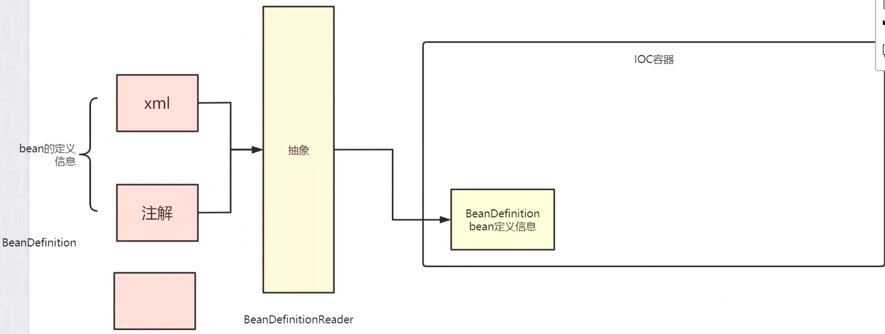
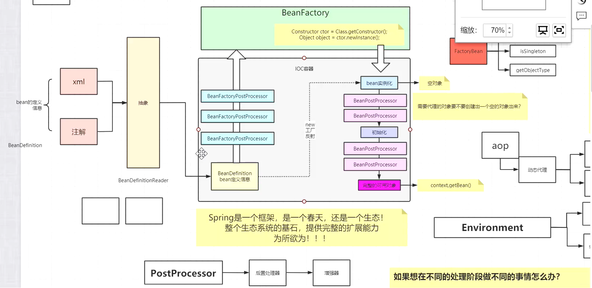

# Spring 原理

### 概览

- IOC
- AOP


## IOC

### Spring IOC 常用注解

#### 使用注解的方式将 bean 注册到 IOC 容器中

这四个注解写在类上面的时候，都可以完成注册bean 的功能，但是这些规定并不是spring识别的依据

在spring运行过程中，不会对这4个注解做任何区分，看起来都是一样的，都会完成bean的注册功能

在实际开发中，最好能分清楚，提高代码的可读性

##### @Component

组件，理论上可以在任何位置添加，在扫描的时候都会完成 bean 的注册。最偷懒的方式，就是给所有需要注册的 bean 上面添加 @Component 注解

##### @Controller

放在控制层，用来接收用户的请求

##### @Service

放在业务逻辑层

##### @Repository

放在 dao 数据访问层

##### @ComponentScan

Spring容器在运行的时候，怎么知道从哪个包扫描呢？

所以，在使用上述注解的时候，需要 xml 文件中配置context:conponent-scan，并且导入 context 命名空间

```java
ApplicationContext context = new ClassPathXmlApplicationContext("applicationContext.xml");
PersonController personController = context.getBean("personController", PersonController.class)
```


##### 使用注解的时候，并没有定义 bean 的 id 和 class，那么 spring 是怎么识别的呢？

是把当前类的名称首字母小写来识别的。需要的话，你可以在注解中使用value=修改名称，一般不会去修改。


#### 使用 @Autowired 进行自动注入

首先，bean 已经被注册到Spring IOC 容器中了，但是如果不使用 Autowired 的话，没有被注入到对象中。

@AutoWired 是通过反射的方式注入的。

##### Autowired 是根据什么依据来装配的呢？by name？by type？

当使用AutoWired注解的时候，自动装配的时候是根据类型实现的。

1. 如果只找到一个，则直接进行赋值，
2. 如果没有找到，则直接抛出异常，
3. 如果找到多个，那么会按照变量名作为id继续匹配,
   1. 匹配上直接进行装配
   2. 如果匹配不上则直接报异常

还可以使用@Qualifier注解来指定id的名称，让spring不要使用变量名,当使用@Qualifier注解的时候也会有两种情况：

1. 找到，则直接装配
2. 找不到，就会报错


##### @AutoWired可以进行定义在方法上

```java
@Controller
public class PersonController {
     /**
     * 当方法上有@AutoWired注解时：
     *  1、此方法在bean创建的时候会自动调用
     *  2、这个方法的每一个参数都会自动注入值
     * @param personDao
     */
    @Autowired
    public void test(PersonDao personDao){
        System.out.println("此方法被调用:"+personDao);
    }
```


#### 自动装配的注解@AutoWired，@Resource 区别

在使用自动装配的时候，出了可以使用@AutoWired注解之外，还可以使用@Resource注解，你需要知道这两个注解的区别。

1. @AutoWired:是spring中提供的注解，

   @Resource:是jdk中定义的注解，依靠的是java的标准

2. @AutoWired默认是按照类型进行装配，默认情况下要求依赖的对象必须存在

   @Resource默认是按照名字进行匹配的，同时可以指定name属性

3. @AutoWired只适合spring框架，而@Resource扩展性更好


# IOC 原理

### 为什么有 IOC 容器？它的好处是什么？

当我们需要获取对象的时候，可以创建一个工厂类，让工厂类帮我们创建对象。能不能把这个过程让别人来做？
我们只需要知道容器里有对象，我们只要拿来用就好了。至于谁创建的，什么时候创建的，这都不需要你操心。
这时候你会想，假设有一个管理器，给你分配 bean，并且可以满足你的个性化需求，这样就好了。于是，我们有了 IOC 容器。

IOC 容器，是使用 Map 存放对象的地方，对象是通过反射创建的。默认情况下，对象在 IOC 容器中都是单例的。如果需要多例，可以修改属性。

#### IOC 和 DI 的关系？

IOC 是控制翻转，DI 是依赖注入。
IOC 和 DI 是从不同的角度描述同一件事情，IOC 是从容器的角度考虑的，而 DI 是从应用程序的角度考虑的。
IOC 只是一种思想，而 DI 才是具体的实现方式。

#### 什么是控制翻转？

有了 IOC 之后，依赖的对象直接由 IOC 容器创建后，注入到对象中。
由我们主动创建，变成了被动接受，这就是控制反转。

### bean 对象信息读取

但是，容器怎么知道你需要什么对象呢？你需要告诉容器，比如通过配置 xml 文件，比如使用注解。BeanDefiniton 就是用来定义类的信息的，你把信息传输给容器，容器接收到信息之后，才能创建对应的对象。
在程序启动的时候，需要把这些定义信息读取进来。但是，有的人用 xml，有的人用注解，怎么统一呢？
这时候，定义一 个 BeanDefinitonReader，用来读取 Bean 的定义信息，如果以后有了新的方式定义 Bean 信息，只需要实现当前接口，就可以了。BeanDefinitonReader 是一个接口，下面有很多不同的实现类，就是很多不同的读取方式。




#### 创建对象

拿到对象信息之后，需要进行实例化操作。我们知道，创建对象可以通过 new / 工厂/ 反射 的方式实现。实际上，Spring 是通过反射的方式创建对象的。BeanFactory 工厂，可以用来生产对象、访问工厂。

```java
// bean 实例化，只是一个空对象，没有任何属性值
Constructor constructor = TestClass.class.getConstructor();
Object o = constructor.newInstance();
```

#### 实例化对象

BeanProcessor 里面有 Before / AfterInitialization




## AOP

### AOP简介

面向切面编程，AOP是OOP的补充，当我们需要为多个对象引入一个公共行为，比如日志，操作记录等，就需要在每个对象中引用公共行为，这样程序就产生了大量的重复代码，使用AOP可以完美解决这个问题。

### AOP 实现机制：动态代理

动态代理和静态代理的区别是，静态代理的的代理类是我们自己定义好的，在程序运行之前就已经变异完成，但是动态代理的代理类是在程序运行时创建的。相比于静态代理，动态代理的优势在于可以很方便的对代理类的函数进行统一的处理，而不用修改每个代理类中的方法。

- cglib
- jdk