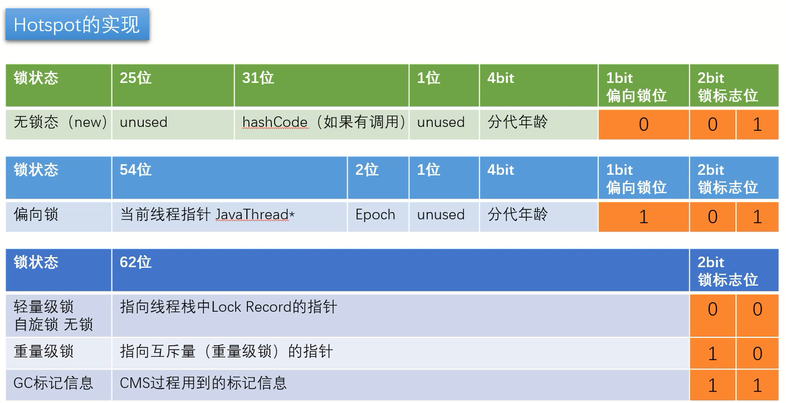
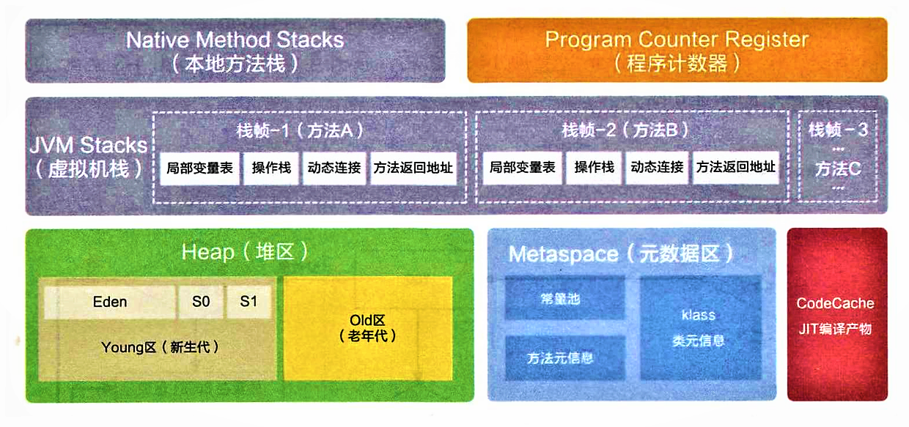
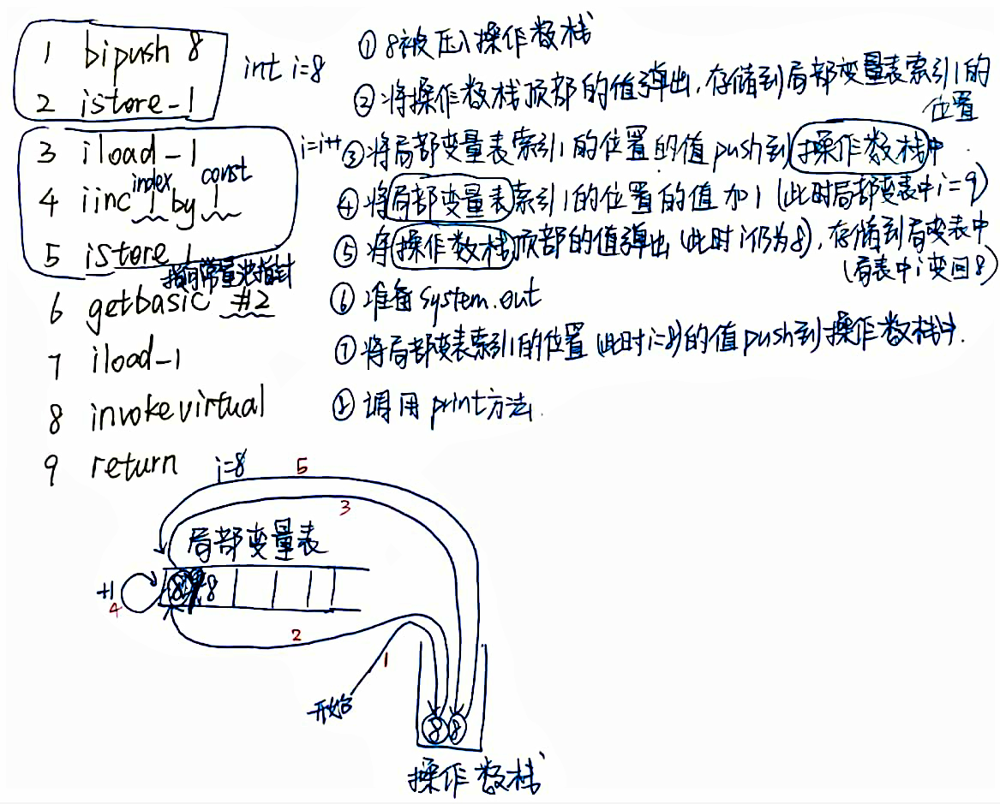

# JVM

### 对象

#### 对象在内存中占多少字节？

查看对象的内存布局工具：JOL = Java Object Layout

```xml
<dependencies>
    <!-- https://mvnrepository.com/artifact/org.openjdk.jol/jol-core -->
    <dependency>
        <groupId>org.openjdk.jol</groupId>
        <artifactId>jol-core</artifactId>
        <version>0.9</version>
    </dependency>
</dependencies>
```

```java
System.out.println(ClassLayout.parseInstance(o).toPrintable());
```

经过试验，一个`Object o = new Object();`  是16字节，（下图是小端）


添加 `syncronized(o){ sout ... }` 之后：下面 00 表示轻量级锁，因为偏向锁未启动，直接升级为了轻量级锁


- **8 字节（对象头 MarkWord，它的大小是固定的）**
- **4 字节（开启压缩时的对象指针 ClassPointer）**
- **4 字节 padding（对齐，要被 8 整除）**


#### 对象头 MarkWord 包括什么？

MarkWord 里面包括：锁信息、HashCode、GC信息。

jdk8u: markOop.hpp 中，详细的说明了 markword 的布局。理解即可，无需背过。

```
Bit-format of an object header (most significant first, big endian layout below):

32 bits:
--------
hash:25 ------------>| age:4    biased_lock:1 lock:2 (normal object)
JavaThread*:23 epoch:2 age:4    biased_lock:1 lock:2 (biased object)
size:32 ------------------------------------------>| (CMS free block)
PromotedObject*:29 ---------->| promo_bits:3 ----->| (CMS promoted object)

64 bits:
--------
unused:25 hash:31 -->| unused:1   age:4    biased_lock:1 lock:2 (normal object)
JavaThread*:54 epoch:2 unused:1   age:4    biased_lock:1 lock:2 (biased object)
PromotedObject*:61 --------------------->| promo_bits:3 ----->| (CMS promoted object)
size:64 ----------------------------------------------------->| (CMS free block)

unused:25 hash:31 -->| cms_free:1 age:4    biased_lock:1 lock:2 (COOPs && normal object)
JavaThread*:54 epoch:2 cms_free:1 age:4    biased_lock:1 lock:2 (COOPs && biased object)
narrowOop:32 unused:24 cms_free:1 unused:4 promo_bits:3 ----->|(COOPs&&CMSpromotedobject)
unused:21 size:35 -->| cms_free:1 unused:7 ------------------>| (COOPs && CMS free block)
```

总结 JDK8 中对象的 MarkWord 布局如下（64 位，也就是 8 字节）：

要看加的是什么锁的话，先看 markword 的最低两位，是 01 / 00 / 10 / 11



为什么 GC 年龄默认为 15？因为分代年龄只有 4 bit，可以表示最大的数就是 15


#### 对象怎么定位？

怎么通过 `t` 找到 `new T()`？

- 通过句柄池（间接法）
- 通过直接指针（HotSpot用的是这种方式）


### Java 程序是怎样运行的？

**1、首先，通过 Javac 编译器将 .java 转为 JVM 可加载的 .class 字节码文件。**

Javac 是由 Java 编写的程序，编译过程可以分为：

 ① 词法解析，通过空格分割出单词、操作符、控制符等信息，形成 token 信息流，传递给语法解析器。

② 语法解析，把 token 信息流按照 Java 语法规则组装成语法树。

③ 语义分析，检查关键字使用是否合理、类型是否匹配、作用域是否正确等。

④ 字节码生成，将前面各个步骤的信息转换为字节码。

字节码必须通过类加载过程加载到 JVM 后才可以执行，执行有三种模式，解释执行、JIT 编译执行、JIT 编译与解释器混合执行（主流 JVM 默认执行的方式）。混合模式的优势在于解释器在启动时先解释执行，省去编译时间。

**2、之后，通过即时编译器 JIT 把字节码文件编译成本地机器码。**

Java 程序最初都是通过解释器进行解释执行的，当虚拟机发现某个方法或代码块的运行特别频繁，就会认定其为"热点代码"，虚拟机即时编译器会把它们编译成本地机器码。

**3、还可以通过静态的提前编译器 AOT 直接把程序编译成与目标机器指令集相关的二进制代码。**


### JVM内存模型

#### class 的生命周期


1. 静静躺在磁盘中的 .class 文件
2. 经过 load，link，initialize，进入 JVM
3. 经过 JVM 的 run engine，进入 JVM 的运行时数据区
4. 最终被 GC

#### Run-time data areas 运行时数据区的组成

我们常说的：栈放方法，堆存对象

堆里面存放的都是一些引用，而栈是我们真正用来执行程序的。可以把每一个方法看做对应一个栈帧。

动态链接：把符号引用（.class文件常量池中的引用）转化为直接引用（指向堆中的对象）



每个线程有自己独立的 PC，VMS，NMS

线程之间共享 Heap 以及 MethodArea

**PC：程序计数器**

**MethodArea：方法区**

类的所有字段和方法字节码，以及一些特殊方法构造函数，接口代码也在这里定义。简单来说，所有定义方法的信息都保存在该区域，静态变量+常量+类信息（构造方法/接口定义）+运行时常量池都存在方法区中

- jdk1.8 之前：在 Perm Space 永久代
  - 字符串常量位于 Perm Space
  - FGC 不会清理
- jdk1.8 及之后：在 Meta Space 元数据区
  - 字符串常量位于 Heap
  - FGC 会清理

**Stacks：栈空间**

- 栈中存放**栈帧**
  - 局部变量表
  - 操作数栈
  - 动态链接
  - 返回值地址

**Heap：堆空间**

虚拟机启动时自动分配创建，用于存放对象的实例，几乎所有对象都在堆上分配内存，当对象无法在该空间申请内存时，抛出OOM异常。也是垃圾收集器管理的主要区域。

- 类实例
- 为数组分配的空间

**DirectMemory：直接内存**

- JVM可以直接访问OS管理的内存，提高效率

  - 零拷贝（不需要拷贝），NIO用到

**Run-Time Constant Pool 运行时常量池**


线程私有的：是交由 JVM 自动化管理的。我们做的 JVM 调优，是调的堆和方法区。


```
package com.mashibing.jvm.c4_RuntimeDataAreaAndInstructionSet;

public class TestIPulsPlus {
    public static void main(String[] args) {
        int i = 8;
        i = i++;
//        i = ++i;
        System.out.println(i);
    }
}
```

