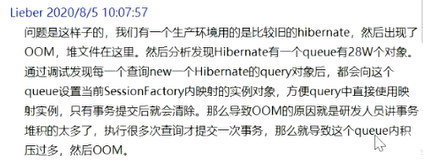
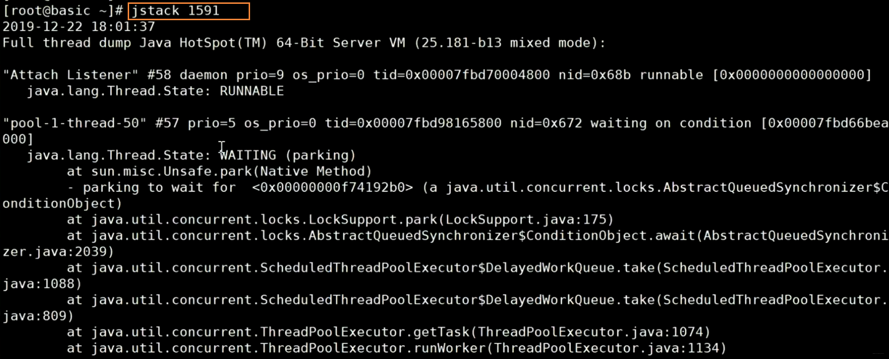

# JVM 调优实战

### JVM 常用命令参数

查看 JVM 启动默认参数：java -XX:+PrintCommandLineFlags -version

```shell
-XX:G1ConcRefinementThreads=10 -XX:GCDrainStackTargetSize=64 -XX:InitialHeapSize=264361280 -XX:MaxHeapSize=4229780480 -XX:+PrintCommandLineFlags -XX:ReservedCodeCacheSize=251658240 -XX:+SegmentedCodeCache -XX:+UseCompressedClassPointers -XX:+UseCompressedOops -XX:+UseG1GC -XX:-UseLargePagesIndividualAllocation
java version "11.0.9" 2020-10-20 LTS
Java(TM) SE Runtime Environment 18.9 (build 11.0.9+7-LTS)
Java HotSpot(TM) 64-Bit Server VM 18.9 (build 11.0.9+7-LTS, mixed mode)
```


#### HotSpot 参数分类

    标准：  - 开头，所有的HotSpot都支持
    非标准：-X 开头，特定版本HotSpot支持特定命令
    不稳定：-XX 开头，下个版本可能取消


#### 调优前的基础概念

所谓调优，首先确定：是吞吐量优先，还是响应时间优先？还是在一定的响应时间下，要求达到多大的吞吐量？

- 吞吐量：用户代码时间 /（用户代码执行时间 + 垃圾回收时间）
  - 科学计算、数据挖掘，一般吞吐量优先
  - PS + PO

- 响应时间：STW越短，响应时间越好
  - 网站、GUI、API，一般响应时间优先
  - 1.8 G1

并发：淘宝双11并发历年最高54万，据说12306并发比淘宝更高，号称上百万

- TPS
- QPS，Query Per Second


#### 什么是调优？

所谓调优，就是调 Java 的一些运行参数


#### 如何监控 JVM？用什么工具？

可以使用 jstat jvisualvm jprofiler arthas top…等等

用 `jmap -hosto pid号` 列出当先系统中哪些对象占的空间非常大、属于哪个类


#### 如何根据需求进行 JVM 规划和预调优？

有人要问你，你应该选用多大的内存？什么样的垃圾回收器组合？你怎么回答？

- 要有实际的业务场景，才能讨论调优
- 要有监控，能够通过压力测试看到结果

步骤：

1. 熟悉业务场景，选择合适的垃圾回收器。是追求吞吐量，还是追求响应时间？

2. 计算内存需求。没有一定之规，是经验值。 1.5G -> 16G，突然卡顿了，为啥？

3. 选定CPU。预算能买到的，当然是越高越好，CPU多核，可以多线程运行呀！

4. 设定年代大小、升级年龄

5. 设定 **日志参数**

6. 这个是 Java 虚拟机的参数，也可以在Tomcat里面配置，貌似是在叫 catalina options 里面指定java日志的参数

   ```
   -Xloggc:/opt/xxx/logs/xxx-xxx-gc-%t.log -XX:+UseGCLogFileRotation 
   -XX:NumberOfGCLogFiles=5 -XX:GCLogFileSize=20M -XX:+PrintGCDetails -XX:+PrintGCDateStamps -XX:+PrintGCCause HelloGC
   ```

   生产中的日志一般是这么设置，5个日志文件循环产生，%t 是生成时间的意思。

7. 观察日志情况


#### 几个调优案例设计

##### 案例1：垂直电商，最高每日百万订单，处理订单系统需要什么样的服务器配置？

这个问题比较业余，因为很多不同的服务器配置都能支撑(1.5G 16G 都有可能啊)。我们做一个假设吧，1小时360000个订单。在集中时间段， 100个订单/秒，（找一小时内的高峰期，可能是1000订单/秒）。我们就要找到这个最高峰的时间，保证你的架构能够承接的住。大多数情况下，是靠经验值，然后做压测。如果非要计算的话，你预估一下，一个订单对象产生需要多少内存？512K * 1000 = 500M

专业一点的问法：要求响应时间在多少时间的情况下，比如100ms，我们去挑一个市面上性价比比较高的服务器，做压测去测试，再不行加内存，再不行，就上云服务器…这样说就OK了。

##### 案例2：12306遭遇春节大规模抢票应该如何支撑？（架构上的一个设计，与调优关系不大）

12306应该是中国并发量最大的秒杀网站：号称并发量最高100W

- 架构模型：CDN -> LVS -> NGINX -> 业务系统 -> 100台机器，每台机器1W并发（单机10K问题），目前这个问题主要用Redis解决

- 业务流程：普通电商订单 -> 下单 -> 订单系统（IO）减库存 -> 生成订单，等待用户付款。12306的一种可能的模型，是异步来进行的： 下单 -> 减库存 和 订单(redis kafka) 同时异步进行 ->等付款，付完款，持久化到Hbase, MySQL等等

问：减库存最后还会把压力压到一台服务器，怎么办？可以做分布式本地库存 + 单独服务器做库存均衡
问：大流量的处理方法？分而治之，每台机器只减自己机器上有的库存
问：流量倾斜的问题怎么解决？比如有的机器上已经没库存了，有的机器上还剩很多？这时候你还需要一台单独的服务器，去做所有服务器的平衡，如果某台服务器没库存了，从别的机器上挪一些过去。


#### 如何优化运行 JVM 运行环境（慢，卡顿）？

##### 案例1：升级内存后反而网站更卡

有一个50万PV的文档资料类网站（从磁盘提取文档到内存）原服务器32位，1.5G的堆，用户反馈网站比较缓慢。因此公司决定升级，新的服务器为64位，16G的堆内存，结果用户反馈卡顿十分严重，反而比以前效率更低了！ 

1. 为什么原网站慢?

   因为很多用户浏览数据，很多用户浏览导致很多数据Load到内存，产生了很多文档对应的Java包装对象（而不是文档对象，文档本身可以走Nginx）。内存不足，频繁GC，STW长，响应时间变慢

2. 为什么会更卡顿？

   内存越大，FGC时间越长

3. 怎么解决？

   PS 换成 PN + CMS，或者 G1
   或者业务上的调整，文档不走JVM


##### 案例2：系统 CPU 经常100%，如何排查、调优？

推理过程是：CPU 100%，那么一定有线程在占用系统资源，所以

1. 找出哪个进程cpu高（top 命令）

2. 该进程中的哪个线程cpu高（top -Hp）

3. 如果是java程序，导出该线程的堆栈 （jstack命令，列出当前程序有哪些线程，以及线程编号，使用arthas工具可以heapdump导出堆栈），导出之后就可以用图形界面了，也可以使用 jmap 分析堆文件，看哪个对象占用内存过多，再去分析业务逻辑。生产环境中，jmap 命令比 archas 好用一些，但是都会导致服务暂停。生产环境一般直接配置参数 -XX:+HeapDumpOnOutOfMemoryError；archas 用的是 agent，可以线上替换 class

4. (查找哪个方法（栈帧）消耗时间，哪个方法调用的哪个方法 (jstack)，然后去看这个方法的代码)

5. 要区分是业务线程占比高 / 垃圾回收线程占比高？


##### 案例3：系统内存飙高，如何查找问题？

1. 导出堆内存 (jmap)
2. 分析 (jhat jvisualvm mat jprofiler … )


##### 案例4：生产环境 OOM，怎么排查?

- java -XX:+HeapDumpOnOutOfMemoryError 生产环境必配

- （最高级的回答）高可用的集群，摘掉一台，进行流量复制重现，然后再线上监控。怎么流量复制？这是另外一个问题。
- 注意不能再生产上用 jmap

关于流量复制：

> 流量复制技术的原理是：复制在线Server的请求数据包(比如HTTP流量、TCP流量、链路层流量等)，修改流量包头部信息，发送给测试服务器，达到欺骗测试服务器程序的目的，从而为欺骗测试服务器上面的上层应用打下基础。
>
> 技术发展现状：目前有各种开源的软件支持流量复制，比如Gor、TCPCopy等。其中，Gor是一款Golang语言编写的简单的http流量复制开源工具，它的工作流程是监听服务器捕捉http流量，把捕捉到的流量发送到重现服务器上或者保存到文件中，重现服务器再继续把流量发送到一个指定的ip地址。


### OOM 案例

C++ 转 Java 的程序员重写了 finalize 方法，当一个对象被回收的时候，这个函数默认被调用，如果你在这个函数中写了很多业务逻辑，回收这个对象就要花好长时间，对象产生速度大于回收速度，导致了 OOM 




## 用一个案例，理解常用工具

1. 测试代码：

```java
   package com.mashibing.jvm.gc;
   
   import java.math.BigDecimal;
   import java.util.ArrayList;
   import java.util.Date;
   import java.util.List;
   import java.util.concurrent.ScheduledThreadPoolExecutor;
   import java.util.concurrent.ThreadPoolExecutor;
   import java.util.concurrent.TimeUnit;
   
   /**
    * 从数据库中读取信用数据，套用模型，并把结果进行记录和传输
    */
   
   public class T15_FullGC_Problem01 {
   
       private static class CardInfo {
           BigDecimal price = new BigDecimal(0.0);
           String name = "张三";
           int age = 5;
           Date birthdate = new Date();
   
           public void m() {}
       }
   
       private static ScheduledThreadPoolExecutor executor = new ScheduledThreadPoolExecutor(50,
               new ThreadPoolExecutor.DiscardOldestPolicy());
   
       public static void main(String[] args) throws Exception {
           executor.setMaximumPoolSize(50);
   
           for (;;){
               modelFit();
               Thread.sleep(100);
           }
       }
   
       private static void modelFit(){
           List<CardInfo> taskList = getAllCardInfo();
           taskList.forEach(info -> {
               // do something
               executor.scheduleWithFixedDelay(() -> {
                   //do sth with info
                   info.m();
   
               }, 2, 3, TimeUnit.SECONDS);
           });
       }
   
       private static List<CardInfo> getAllCardInfo(){
           List<CardInfo> taskList = new ArrayList<>();
   
           for (int i = 0; i < 100; i++) {
               CardInfo ci = new CardInfo();
               taskList.add(ci);
           }
   
           return taskList;
       }
   }
  
```

2. `java -Xms200M -Xmx200M -XX:+PrintGC com.mashibing.jvm.gc.T15_FullGC_Problem01`

3. 一般是运维团队首先受到报警信息（CPU过高， Memory占比大...然后你才去查原因）

4. top命令观察到问题：内存不断增长 CPU占用率居高不下

5. top -Hp 观察进程中的线程，哪个线程CPU和内存占比高

6. jps定位具体java进程
   jstack 定位线程状况，重点关注：WAITING BLOCKED
   e.g.
   `waiting on <0x0000000088ca3310> (a java.lang.Object)`
   假如有一个进程中100个线程，很多线程都在`waiting on <xx>` ，一定要找到是哪个线程持有这把锁
   怎么找？搜索jstack dump的信息，找<xx> ，看哪个线程持有这把锁RUNNABLE
   作业：
   1: 写一个死锁程序，用jstack观察 
   2: 写一个程序，一个线程持有锁不释放，其他线程等待

7. 为什么阿里规范里规定，线程的名称（尤其是线程池）都要写有意义的名称？为了方便定位！
   怎么样自定义线程池里的线程名称？（自定义ThreadFactory）

8. `jinfo pid`了解即可，用处不是特别大

9. `jstat -gc` 动态观察gc情况 / 阅读GC日志发现频繁GC / arthas观察 / jconsole/jvisualVM/ Jprofiler（最好用，收费）
   jstat -gc 4655 500 : 每个500个毫秒打印GC的情况
   如果面试官问你是怎么定位OOM问题的？如果你回答用图形界面（错误）
   1：已经上线的系统不用图形界面用什么？（cmdline arthas）
   2：**图形界面到底用在什么地方？测试**！测试的时候进行监控！（压测观察）

10. jmap - histo 4655 | head -20，查找有多少对象产生，这个命令对线上系统影响不大。
    `jmap -dump:format=b,file=xxx pid `手动导出堆文件，这个命令不能线上用。
    线上系统，内存特别大，**jmap执行期间会对进程产生很大影响**，甚至卡顿（电商不适合），你可以这么说：
    1：设定了参数HeapDump，OOM的时候会自动产生堆转储文件
    2：<font color='red'>很多服务器备份（高可用），先把这台机器隔离开，停掉这台服务器对其他服务器不影响</font>
    3：在线定位arthas(一般小点儿公司用不到，这样吹容易露馅儿)

11. java -Xms20M -Xmx20M -XX:+UseParallelGC -XX:+HeapDumpOnOutOfMemoryError com.mashibing.jvm.gc.T15_FullGC_Problem01

12. 使用MAT / jhat /jvisualvm 进行dump文件分析
     https://www.cnblogs.com/baihuitestsoftware/articles/6406271.html 
    jhat -J-mx512M xxx.dump
    http://192.168.17.11:7000
    拉到最后：找到对应链接
    可以使用OQL查找特定问题对象

13. 找到代码的问题


## 实战


top 命令


列出1591进程下的所有线程，重点关注：WAITING BLOCKED



Java 日志

