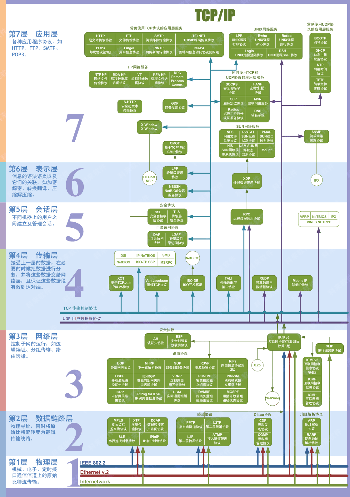

# 网络IO

### OSI 与 TCP/IP 各层的结构与功能，都有哪些协议?


#### 七层体系结构图 

7层是学术界的结果（没有落地），5层是工业界的结果

描述了如何架构整个互联网生态的问题



#### 1、应用层

**应用层(application-layer）的任务是通过应用进程间的交互来完成特定网络应用。**应用层协议定义的是应用进程（进程：主机中正在运行的程序）间的通信和交互的规则。对于不同的网络应用需要不同的应用层协议。在互联网中应用层协议很多，如 **域名系统DNS**，支持万维网应用的 **HTTP协议**，支持电子邮件的 **SMTP协议**等等。我们把应用层交互的数据单元称为报文。

**域名系统**

> 域名系统(Domain Name System缩写 DNS)是因特网的一项核心服务，它作为可以将域名和IP地址相互映射的一个分布式数据库，能够使人更方便的访问互联网，而不用去记住能够被机器直接读取的IP数串。

**HTTP协议**

> 超文本传输协议（HTTP，HyperText Transfer Protocol)是互联网上应用最为广泛的一种网络协议。所有的 WWW（万维网） 文件都必须遵守这个标准。设计 HTTP 最初的目的是为了提供一种发布和接收 HTML 页面的方法。（百度百科）

#### 2、传输层

**运输层(transport layer)的主要任务就是负责向两台主机进程之间的通信提供通用的数据传输服务**。应用进程利用该服务传送应用层报文。“通用的”是指并不针对某一个特定的网络应用，而是多种应用可以使用同一个运输层服务。由于一台主机可同时运行多个线程，因此运输层有复用和分用的功能。所谓复用就是指多个应用层进程可同时使用下面运输层的服务，分用和复用相反，是运输层把收到的信息分别交付上面应用层中的相应进程。

**运输层主要使用以下两种协议:**

1. **传输控制协议 TCP**（Transmission Control Protocol）--提供**面向连接**的，**可靠的**数据传输服务。
2. **用户数据协议 UDP**（User Datagram Protocol）--提供**无连接**的，尽最大努力的数据传输服务（**不保证数据传输的可靠性**）。

**TCP 与 UDP 的对比见问题三。**

#### 3、网络层

**在计算机网络中进行通信的两个计算机之间可能会经过很多个数据链路，也可能还要经过很多通信子网。网络层的任务就是选择合适的网间路由和交换结点， 确保数据及时传送。** 在发送数据时，网络层把运输层产生的报文段或用户数据报封装成分组和包进行传送。在 TCP/IP 体系结构中，由于网络层使用 **IP 协议**，因此分组也叫 **IP 数据报** ，简称 **数据报**。

这里要注意：**不要把运输层的“用户数据报 UDP ”和网络层的“ IP 数据报”弄混**。另外，无论是哪一层的数据单元，都可笼统地用“分组”来表示。

这里强调指出，网络层中的“网络”二字已经不是我们通常谈到的具体网络，而是指计算机网络体系结构模型中第三层的名称.

互联网是由大量的异构（heterogeneous）网络通过路由器（router）相互连接起来的。互联网使用的网络层协议是无连接的网际协议（Intert Protocol）和许多路由选择协议，因此互联网的网络层也叫做**网际层**或**IP层**。

#### 4、数据链路层

- 数据链路层传输的是数字信号 010101
- 网卡是将 **模拟信号->数字信号**、**数字信号->模拟信号** 的过程，既不属于物理层，也不属于数据链路层，网线上传输的是模拟信号

**数据链路层(data link layer)通常简称为链路层。两台主机之间的数据传输，总是在一段一段的链路上传送的，这就需要使用专门的链路层的协议。** 在两个相邻节点之间传送数据时，**数据链路层将网络层交下来的 IP 数据报组装成帧**，在两个相邻节点间的链路上传送帧。每一帧包括数据和必要的控制信息（如同步信息，地址信息，差错控制等）。

在接收数据时，控制信息使接收端能够知道一个帧从哪个比特开始和到哪个比特结束。这样，数据链路层在收到一个帧后，就可从中提出数据部分，上交给网络层。 控制信息还使接收端能够检测到所收到的帧中有误差错。如果发现差错，数据链路层就简单地丢弃这个出了差错的帧，以避免继续在网络中传送下去白白浪费网络资源。如果需要改正数据在链路层传输时出现差错（这就是说，数据链路层不仅要检错，而且还要纠错），那么就要采用可靠性传输协议来纠正出现的差错。这种方法会使链路层的协议复杂些。

#### 5、物理层

- 物理层传输的是光电信号

在物理层上所传送的数据单位是比特。 **物理层(physical layer)的作用是实现相邻计算机节点之间比特流的透明传送，尽可能屏蔽掉具体传输介质和物理设备的差异。** 使其上面的数据链路层不必考虑网络的具体传输介质是什么。“透明传送比特流”表示经实际电路传送后的比特流没有发生变化，对传送的比特流来说，这个电路好像是看不见的。


##### 数据经过网卡，传输到 CPU 的过程


## TCP 协议

### TCP 的状态变迁图


### TCP 协议如何保证可靠传输？

1. 应用数据被分割成 TCP 认为最适合发送的数据块。
2. TCP 给发送的每一个包进行编号，接收方对数据包进行排序，把有序数据传送给应用层。
3. **校验和：** TCP 将保持它首部和数据的检验和。这是一个端到端的检验和，目的是检测数据在传输过程中的任何变化。如果收到段的检验和有差错，TCP 将丢弃这个报文段和不确认收到此报文段。
4. TCP 的接收端会丢弃重复的数据。
5. **流量控制：** TCP 连接的每一方都有固定大小的缓冲空间，TCP的接收端只允许发送端发送接收端缓冲区能接纳的数据。当接收方来不及处理发送方的数据，能提示发送方降低发送的速率，防止包丢失。TCP 使用的流量控制协议是可变大小的滑动窗口协议。 （TCP 利用滑动窗口实现流量控制）
6. **拥塞控制：** 当网络拥塞时，减少数据的发送。
7. **ARQ协议：** 也是为了实现可靠传输的，它的基本原理就是每发完一个分组就停止发送，等待对方确认。在收到确认后再发下一个分组。
8. **超时重传：** 当 TCP 发出一个段后，它启动一个定时器，等待目的端确认收到这个报文段。如果不能及时收到一个确认，将重发这个报文段。


### TCP协议

TCP 是面向连接的，可靠的传输协议，是有确认的。

一台主机最多65535个端口号。（别人进来访问我的话，访问的都是我的同一个端口号，比如80）

在线视频传输不适合每一个包都相互确认，因此视频不是通过TCP/IP协议传输的


### IP 协议

鱼和熊掌不可兼得：低延迟、高吞吐量、低丢包率、低成本，如果要保证前三个的话，设备成本会很高。

IPV4 协议头


#### UDP 协议

UDP 协议使对 IP 协议的封装。为什么不直接用 IP 协议，而要用 UDP 协议？因为 IP 协议只能把数据从一个网卡发送到另一个网卡，而 UDP 协议可以定位到具体的应用程序，即 IP:port


HTTP3.0 就是建立在 UDP 上的，因为它协议简单，虽然没有提供可靠性，但是它给你自己的实现提供了无数种可能，这也是 UDP 的优势。HTTP3.0 就是利用 UDP 在上面重新搭建了自己的协议，并且重新实现了可靠性。因此，如果在极端应用场景下（如，大并发）你有实力在简单的 UDP 基础上保证可靠性，提高传输速度，你也可以采用 UDP 协议，在上面搭东西去优化。

### 三次握手


三次握手只是在建立连接。三次握手之后，才有资源的开辟。可以开始传输数据了。

1. **C -> S (syn, `seq=j`)**    C 说，我想连接
2. **S -> C (syn+ack, `ack=j+1`, `syn=k`)**    发完之后，C 知道了 S 能收到自己的消息
3. **C -> S (ack, `ack=k+1`)**    发完之后，S 知道了 C 能收到自己的消息（确认是双向的），这就是为什么需要第三次握手

三次握手之后，双方开辟资源，建立了 socket，实际应用时，第三次握手包和发送的数据包是粘连在一起的。


### 四次分手


1. **C -> S (FIN)**    C 说，我想断开连接
2. **S -> C (FIN+ack)**    S 知道了 C 想断开（但此时不能立刻销毁连接，因为可能还有一些数据没有发送完毕）
3. **S -> C (FIN)**    S 说，我也想断开连接
4. **C -> S (ack)**    C 说，好的，断开吧

然后连接的两方就都会销毁之前开辟的资源。

三次握手->数据传输->四次分手，这个过程称为一个最小粒度，不可被分割。

#### 为什么握手需要三次，分手需要四次？ 

如果类比三次握手，在第二次挥手的时候同时发 FIN + ACK 明显不合理，因为被动方可能没有数据发送完，你这么关太草率了，所以需要四次。

#### 为什么四次分手之后，还会等两个传输时间，才会释放资源？ 

因为如果最后 C 端返回的 ACK 号丢失了，这时 S 端没有收到 ACK，会重发一遍 FIN，如果此时客户端的套接字已经被删除了，会发生什么呢？套接字被删除，端口被释放，这时别的应用可能创建新的套接字，恰好分配了同一个端口号，而服务器重发的 FIN 正好到达，这个 FIN 就会错误的跑到新的套接字里面，新的套接字就开始执行断开操作了。为了避免这样的误操作，C 端会等几分钟再删除套接字。


#### socket

套接字，`ip:port ip:port` 四元组，为了区分每一个 socket 对应关系


## IP 地址

- IP 地址 `‭11000000‬ ‭10101000‬ ‭10010110‬ 0000‭0011‬ (192.168.150.11)`

- 子网掩码：二进制按位与 `11111111 11111111 11111111 00000000 (255.255.255.0)` 

- 子网：`‭11000000‬ ‭10101000‬ ‭10010110‬ 0000‭0000 (192.168.150.0)`‬

- 下一跳机制

  - 路由表

    

  - 通过修改 mac 地址找下一跳。在不考虑 NAT 的情况下，ip 地址不会改变

    - mac 地址记录在 arp 表中
    - 链路层


## HTTP 长连接、短连接

在HTTP/1.0中默认使用短连接。也就是说，客户端和服务器每进行一次HTTP操作，就建立一次连接，任务结束就中断连接。当客户端浏览器访问的某个HTML或其他类型的Web页中包含有其他的Web资源（如JavaScript文件、图像文件、CSS文件等），每遇到这样一个Web资源，浏览器就会重新建立一个HTTP会话。

而从HTTP/1.1起，默认使用长连接，用以保持连接特性。使用长连接的HTTP协议，会在响应头加入这行代码：

```css
Connection:keep-alive
```

在使用长连接的情况下，当一个网页打开完成后，客户端和服务器之间用于传输HTTP数据的TCP连接不会关闭，客户端再次访问这个服务器时，会继续使用这一条已经建立的连接。Keep-Alive不会永久保持连接，它有一个保持时间，可以在不同的服务器软件（如Apache）中设定这个时间。实现长连接需要客户端和服务端都支持长连接。

**HTTP协议的长连接和短连接，实质上是TCP协议的长连接和短连接。**