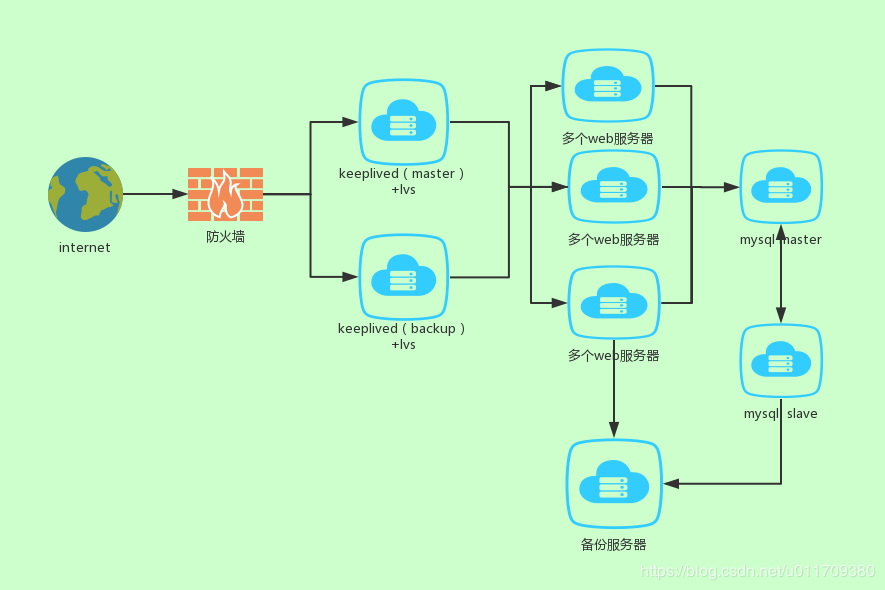
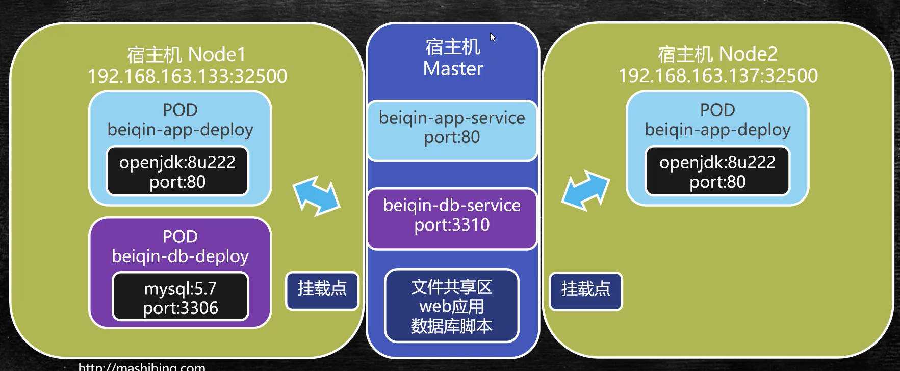

# 关于项目

### 整体概述

四台服务器

- MySQL 两台，master + slave
  - 代码环境是 springboot+mybatis+druib 连接池。想要读写分离就需要配置多个数据源，在进行写操作是选择写的数据源，读操作时选择读的数据源。其中有两个关键点：
    - 如何切换数据源
    - 如何根据不同的方法选择正确的数据源
    - https://www.cnblogs.com/wuyoucao/p/10965903.html
- Redis + 图片服务器，同一台
- GitLab + Jenkins 同一台
- Web 服务两台
- Nginx 一台，同时用作 Backup，shell 脚本定时备份数据库（这里可以引出 LVS 四层负载均衡，但由于并发量不大，没有必要）
- windows7 一台， python 定时更新数据，需要软件登录才能拿到接口权限

项目分为两个模块：

#### 1、xxx-data模块

SpringBoot

Vue

BootStrap

#### 2、scheduler模块

python apscheduler

#### 3、部署方式

GitLab + Jenkins，写的shell脚本，自动构建（这里可以引出对k8s有过了解）

项目拓扑：

### 用到的设计模式

- **单例模式：**有一个 PropertyManager，用来获取与业务逻辑相关的 有效起始时间、所属类别、不同品种的关注月份 等配置
- **策略模式**：前端页面有多种不同的排序方式按钮，需要根据不同的统计值，比如：相同品种下不同地区的基本面价格排序；n日均价排序；库存量排序等等。于是写了一自定义的 ReportComparator 接口，把每种不同的排序方式，写成一个独立的类去继承这个接口，在调用 utils 中的 Sorter.sort 方法时，直接传入这个实现类（为了提高效率，没有使用配置文件反射获取）

### 项目难点是什么

### 并发量最大是多少，怎么优化的

没有统计过并发量，但是有一个类似论坛模块，将一个8s+的页面优化到2s以内。

因为业务需要用到一个特殊的排序逻辑，需要解析一个比较大的json文件。读文件的时间从 28s 优化成 1s。

- SPU SKU 解析优化

  

比如我要查“黑鸭”关键字，条件是score>0.2，我要你返回它的id，我们要实现它。

你需要设计一个倒排索引就可以了。

##### 设计

- json文件

- TextReader： 读取 json，解析json，提取关键字

  - ItextReader：一行一行读就行，返回json字符串

  - FileTextReader.java，读文件使用 FileChannel 优化，优化之后，读文件的时间从 28s 优化成 1s，那他为什么会变快呢？优化前，使用buffered，需要经过各种copy

    

    优化后

    

  - FileInputStream 优化：增加缓冲区大小
    弊端：内存消耗大，增加gc次数

  - KeyWordEngine 添加线程池，在读取 SpuBean 类型的 List 的时候，使用多线程并且 ParallelStream 将关键字读取到 KeywordStore 中并存储

- KeywordStore： 存储关键字

- service： 对接 service 接口

- JVM 调优

  

### 日志怎么配置、管理的

- 10文件，50M，滚动输出
- shell 脚本定时备份

### JVM 怎么调优的

- 遇到的线上 OOM，排查过程
- 有一个接口时好时坏，排查过程，最后是连接池的问题

### 项目有什么改进的

- 可以把提供商的 python 接口对外暴露，就可以用 java 调用了

- 是公司最核心代码的编写者，专业技术全面，能解决各种生产主句架构和运维的疑难问题
- 可以写3个精通，如果拿不到面试机会，增加精通个数
- 答案可能不是很精确，但语气让你对正确答案产生怀疑
- 准备几个高级的业务名词
- 软件架构、硬件架构都想好，想清楚多少台服务器，服务器配置，linux版本，CPU，内存
- 想清楚项目有什么地方可以改进
- 想清楚项目有多大规模：数据库多少张表，多少行代码，表结构是什么样的，表多大，有多少人参与，你是什么角色（最重要模块的核心程序员，不要说是一个人搞的整个项目）
- 数据量多大，并发量多大（找哟个能让并发量很大的点，可以是其他部门），怎么优化的过程，优化效果
- 项目心得，项目改进
- 项目难点：开发人员无意编写了死循环导致创建大量对象，并导致服务器CPU空转，可以说排查思路
- 你有什么要问我的？“我了解过咱们公司主要是做电信这方面业务的，...，招人的时候主要用到哪些技术栈？想了解一下。” 去公司之前做足功课，了解公司正在从事哪方面业务，了解人员规模
- 说一个技术的时候，最好带着说出应用场景，举例子，否则有背面试题之嫌
- 说算法的时候，把类比的算法都说出来，两阶段提交，三阶段提交，...，论文作者怎么想的
- 讨论 java 的各种属性的时候，结合 jdk 版本说

##### 问你的理想，你的优缺点，你的职业规划

- 技术上，希望踏实走技术路线，对技术比较感兴趣
- 生活上：正正常常做一个社会上的人，对这个社会做出相应的贡献
- 职业规划：没有考虑20,30年以后的事，因为对技术比较感兴趣，所以3-5年之内的规划是成为技术专家，对业务、对架构、对技术的底层知识做一些更深入的研究，期望能在技术方面做出自己的一些优越的贡献

##### 你有什么优缺点

- 优点：刻苦、能坚持、学习能力还算不错、打交道沟通方面不错
- 缺点：原则是能够意识到自己的缺点，并且说出反思。不要变相的夸自己的优点，不要玩一些小技巧，应该看起来更真实。
  - 过去一段时间自尊心强，不接受别人的意见，现在改正了
  - 意志力不够坚定，容易听人劝
  - 比较擅长和技术人员沟通，不太擅长和业务人员沟通，甚至起过冲突，后来意识到不能只是站在技术角度考虑问题，应该站在更高的业务角度去考虑，因此在不断改进、慢慢成长
  - 解决问题只会从技术角度看，不懂得整合资源、借力，现在慢慢学会站在更高的角度考虑问题（某大佬成功的原因：不辞活儿，站在老板的角度考虑问题）

##### 你理想中的工作

- 与自己的技术相匹配，有一些挑战，能得到一些提升

对项目描述要准确，不要看起来不懂装懂：态度问题。一些问题没接触过很正常。不要所有问题都抢着说，要展示态度。