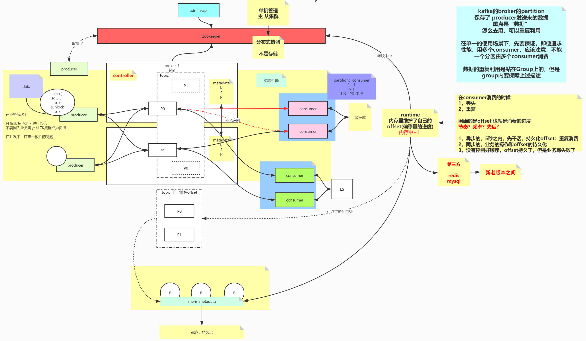

# 技术分享：Kafka 的使用及架构模型推导

今天我们主要的目标是想要跟大家分享一下 Kafka 在真实项目中的使用和原理方面的一些内容，还有后续的一些架构方面的思考。

如果没有时间听完的同学，可以简单地看一下这个概述。今天我们分享的时间预计在 40 分钟左右。

### kafka 在推荐系统数据流中的作用

先对 kafka 有一个整体的概念（敏感信息已作处理），顺便分享一下推荐系统数据流。

我们来看这儿，首先推荐系统需要一些输入。这些输入包括：

- 文章信息
- 用户信息
- 一些上下文信息

上述这些信息属于人类可读的特征。我们把这些信息输入到一个抽特征的库中，转化为机器可读的特征，然后输入给模型，之后会得到预测结果也就是分数。

根据这个分数，对文章进行一些排序和推荐，然后把排序比较靠前的文章推送给用户，用户看到文章之后，如果感兴趣，会点进去，然后也可能会写一些评论，点赞，点分享之类。所以我们会利用这些操作数据来进行模型的训练。这一就是我们的推荐系统的整体流程。

一个好的模型对于推荐系统是非常重要的。怎么才能得到一个好的模型呢，我们需要大量的样本来训练这个模型。样本是由模型的输入以及标签组成的。我们的推荐系统恰好有这两个部分，所以我们可以直接去复用它，不需要做重复的计算。

我们把这两个部分放在队列中：**模型的输入在存放特征的 kafka 队列中拿到，标签通过对用户的行为进行转换之后拿到。用户行为存在 kafka 队列中**。

现在我们我们有了模型的输入之后，需要对这两个输入（**特征**和**标签**）做拼接，让它成为完整的样本，才能发送给模型。-> joiner 服务

但是我们会发现，那正是因为特征和标签的到达时间不同，所以我们需要设置缓存对它们进行一个拼接。缓存的作用是：缓存先到达的部分，去等待后到达的部分。

有了缓存之后，会引出一些新的问题：

1. 由于内存的限制，我们不可能无限期的去等待一个用户。
2. 我们希望能够尽可能快的对用户的操作产生反馈，比如说用户刚才浏览了一些美食相关的内容，那后续我们给用户推送文章的时候就会比较倾向于用户的喜好，而不是说过了一个星期，或者说过了一个月之后，才开始给用户去推这些美食相关的文章。

那么，怎么去设计这个缓存，才能解决这个问题呢？

首先，在 **理想** 状态下，我们认为用户的所有行为都是在180s时间间隔内发生的。而实际上，我们并不能提前预期用户的行为。由于内存有限，我们不可能无限地去等待这个用户，不能为每一个用户都去缓存无限长的时间，要不然内存会爆，所以我们有一个强制超时时间的机制：从用户第一次请求开始，最多等30分钟，30分钟之内的操作，我们会收集到，30分钟以后的操作，就丢弃掉了。

实际上这也是一个权衡的结果，我们是在 **模型对于用户操作的反馈的及时性** 和 **数据的完整性** 之间做出了一个权衡。

上面的过程是在 joiner 中我们根据 key 对文章特征和用户反馈做了 **聚合**，聚合之后我们得到一个 **样本**，我们把样本发送给模型。模型会计算出预测结果，然后后续的操作是：我们根据由userAction生成的label和预测结果之间的差别，去不断地更新模型的参数，并且把参数同步到线上的模型中，这样我们就让模型得到了更新。

**我们现在讲的是通用的解决方案。**下面我们来看一下 kafka，以及分布式架构模型的推导。

### kafka 架构模型推导

> kafka 的 what why how，先有一个粗略宏观的理解
>
> rabbitmq、各种 mq 的技术选型、横向对比

首先，kafka 是一个消息中间件。我们从一个本质的点聊起，我们有一个系统，里面有两个 service，如果这两个服务之间直接调用的话，它们之相互约束、耦合性，且未来的拓展性不好。一方有调整的时候，另一方会受影响。

这时候我们加入一个消息系统，一方发送消息，另一方去取，就起到了我们所谓的消峰填谷以及解耦的效果。

现在我们聊的是消息的中间件，其实中间件包括很多分类：

- 存储中间件
- 缓存中间件

他们的作用都有一个相通性，就是他们最终都会与 **分布式** 挂钩。

说到中间件，会有几个词汇的需求：**可靠的、可扩展的、高性能**。在 redis 中，我们会有 AKF 微服务划分原则，那 kafka 和 AKF 划分有什么联系呢，下面我们来讲。

先举一个简单的例子，然后去挑这个例子的毛病，然后就知道为什么 kafka 会被设计成现在这个样子了。

现在我们假设，整家公司只有一个系统。所有消息被调用的时候，都被打到同一个单机队列中，这时实现了削峰填谷。但随着业务增大，并发量的随之增大，单机队列会有**单点问题、性能问题**。这两个独立的问题可独立的解决，解决方案也可以独立的应用，但更多时候我们将他们整合应用。

##### 解决性能问题：y 轴上的拆分

我们要先解决性能问题，因为 kafka 的关键词里面，先是 topic，然后是 partition，再是副本。

性能问题是怎么解决的？以 AKF 的角度来说，它有三个维度：

- x 轴解决单点问题，实现高可用
- y 轴实现业务划分
- z 轴实现分片、分治

 

那我们如何把这三个轴对应到 kafka 的特性上？首先， y 轴将消息按业务划分。例如，在一个电商系统，可以将订单拆出一个队列、用户行为拆成一个队列、广告推荐拆成一个队列。

- 这样划分之后，不同业务的生产和消费都不会相互影响，业务之间的隔离性会比较好。
- 按照业务划分之后，不同的业务数据会被部署在整个 kafka 集群中的不同的节点上，资源利用率高。

因此，如果将我们上面说的单机版消息队列从逻辑上拆分，第一个拆出来的就是 topic，我们说的 y 轴其实就是 topic。可以把 topic 理解成是业务。

##### 解决单点问题：z 轴上的拆分

假设用户行为日志存在某个 topic 中，如果日志量太大，全部存放在一个节点（中的一个进程）上的话，工作起来 IO 上会受限，而且会有性能瓶颈。怎么解决性能瓶颈？在一个 topic 下，会有多个 partition，partition 就是分区的概念。

分区作用的就是我们的 z 轴，因为在业务使用的时候，假如说我们希望用 kafka 去存用户行为日志，我们会期望把这些日志由一个变成多个，用多台机器有更大的能力去承载它。

z 轴其实是对 y 轴一个细分。细分的时候，可以使用的拆解的方案会有很多：

- range
- hash
- 随机...

拿推荐系统中收集用户行为的例子来说，要把所有的用户行为日志打散到多台里面去，怎么打才合适？

当使用的数据从一个线性的队列散落到多个地方的时候，如何去保证前面的生产最后消费的数据的一致性？

一旦一变多，会带来一致性的问题，那我们的生产方和消费方，如何组建这个先后关系，保证它仍然是有序的？

在 AKF z 轴的划分：如果学过大数据，例如 Flink，Spark，MR，可以引入分治的概念。

- 大数据必然会有分治，也就是 map 阶段，map by key
- 也会有聚集 reduce，就是相同的数据要打到一起去，然后收集起来进行后续的处理

kafka 中依然是这个原理。在生产用户行为日志的时候，有 “展现，点击，收藏” 三种不同的用户行为，只要他们各自有自己的顺序。在分而治之的时候，将无关的打开，分散出去，将有关的放在一起，一定要保证顺序。

所以这时候，z 轴应该如何实现？规划好整个数据路由。将无关数据放在不同的 partition 中。

无关的数据可以并行计算的。如果有关的话，我们会需要在他们之间加上一个分布式锁，这样所谓的并发最终还会退化为串行。所以我们希望将并行最大化，将无关的数据分散到不同的分区里，以追求并发、并行处理。有关联的数据，一定要按照原有顺序发送到同一个分区里。

> topic 是逻辑概念，partition 是最后物理的对应，一个 topic 下面有 partition 1,2,3...

##### 解决可靠性问题：x 轴方向上的副本

x 轴：可靠性的保证。

我们已通过 y 轴和 z 轴，将消息打散到不同的分区，实现的是计算的并行，提升了性能。这时，如果某一个分区挂掉了，消息会丢失，这时候需要我们给它做副本。

纯内存的 redis，必须有持久化：它会认为磁盘是自己可靠性的来源。如果不在单机的维度，而是看**集群的维度**的话，单物理节点可能也会丢失。这为了解决节点的问题，需要网络的维度提供可靠性。

- redis 会有单机的持久化、网络的持久化，基于网络的主从复制集群。主从复制集群就来自于它的 x 轴。
- kafka 也一样，kafka 分区的数据会持久化到磁盘当中去，利用**顺序读写**这种高性能的磁盘 IO。

x 轴的拆分，会比较容易出现数据一致性、数据的同步问题。分布式集群下有一些解决方案，比如 mysql 会有读写分离的策略，为了解决一致性和复杂性上的痛点，kafka 只允许在主片上增删改，从片只允许读。

**由单机到分布式，或者说由传统到中间件，基本都是按照这个思路来设计的。**我们用到的各种分布式中间件的实现，和 AKF 这一侧是有必然的这么一个参照和关联的关系的。

这些都是方法论，来推导出 kafka 中有 topic，partition，有序性的这些概念，然后我们再把有序性做一个延伸：offset

> The **offset** is a simple integer number that is used by **Kafka** to maintain the current position of a consumer. That's it. The current **offset** is a pointer to the last record that **Kafka** has already sent to a consumer in the most recent poll. So, the consumer doesn't get the same record twice because of the current **offset**.
>
> **Offsets** in **Kafka** are stored as messages in a separate topic named '__consumer_offsets' . Each consumer commits a message into the topic at periodic intervals.

实际上，企业中会有很多个 topic，每个业务下都会有很多 topic，每个 topic 下会有几百个 partition，如何去管理这些分布式的东西的一致性？在经验中，**主从**是管理成本最低的，它的协调成本会比**主主**要低。kafka 采用的是主从的方式。

这样会引发一系列分布式协调的问题：如何选主、如何保证数据的一致性等等。常用的解决方案：zookeeper，etcd。

那我们的 kafka 会依赖 zookeeper，依赖其分布式协调，不要把 zookeeper 当做是分布式存储来使用。

##### kafka 对 zookeeper 的依赖

kafka 的 broker 依赖于 zookeeper

- 使用 zk 存储 broker 的元数据，将 broker 当做是一个进程。
- 使用到 zk 的选举机制

zookeeper 的分布式协调原理我们在这里就不细讲了，涉及到 Paxos 协议，ZAB 协议等等，感兴趣的话可以去阅读一下官方文档，或参考 [8.1-CAP定理与zookeeper](/notes/8.1-zookeeper)

