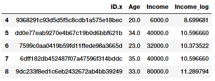

## WeChat_Big_Data_Challenge

baseline github: https://github.com/WeChat-Big-Data-Challenge-2021/WeChat_Big_Data_Challenge

my fork: https://github.com/HanquanHq/WeChat_Big_Data_Challenge

#### 1、代码中对数据取log的原因

```python
sample[feed_feature_col] = np.log(sample[feed_feature_col] + 1.0) # 为什么取log
sample[user_feature_col] = np.log(sample[user_feature_col] + 1.0)
```

##### 参考1

https://datascience.stackexchange.com/questions/40089/what-is-the-reason-behind-taking-log-transformation-of-few-continuous-variables

Mostly because of skewed distribution. Logarithm naturally reduces the dynamic range of a variable so the differences are preserved while the scale is not that dramatically skewed. Imagine some people got 100,000,000 loan and some got 10000 and some 0. Any feature scaling will probably put 0 and 10000 so close to each other as the biggest number anyway pushes the boundary. Logarithm solves the issue.

##### 参考2

https://towardsdatascience.com/understanding-feature-engineering-part-1-continuous-numeric-data-da4e47099a7b

Log transforms are useful when applied to skewed distributions as they tend to expand the values which fall in the range of lower magnitudes and tend to compress or reduce the values which fall in the range of higher magnitudes. This tends to make the skewed distribution as normal-like as possible. Let’s use log transform on our developer `Income` feature which we used earlier.

```python
fcc_survey_df['Income_log'] = np.log((1+ fcc_survey_df['Income']))
fcc_survey_df[['ID.x', 'Age', 'Income', 'Income_log']].iloc[4:9]
```



##### 偏度(Skewness)

用来描述数据分布的对称性，正态分布的偏度为0。计算数据样本的偏度，当偏度<0时，称为负偏，数据出现左侧长尾；当偏度>0时，称为正偏，数据出现右侧长尾；当偏度为0时，表示数据相对均匀的分布在平均值两侧，不一定是绝对的对称分布，此时要与正态分布偏度为0的情况进行区分。

当偏度绝对值过大时，长尾的一侧出现极端值的可能性较高。

##### 峰度(Kurtosis)

用来描述数据分布陡峭或是平滑的情况。正态分布的峰度为3，峰度越大，代表分布越陡峭，尾部越厚；峰度越小，分布越平滑。很多情况下，为方便计算，将峰度值－3，因此正态分布的峰度变为0，方便比较。

在方差相同的情况下，峰度越大，存在极端值的可能性越高。

```python
print(df.skew()) # 偏度计算
print(df.kurt()) # 峰度计算
```

##### 验证 log 操作对偏度的作用

log 操作使偏态分布的样本尽可能转换为正态分布


##### 拓展

https://www.zhihu.com/question/22012482

在统计学中为什么要对变量取对数？

是因为经济数据大多数都是偏态分布，比如收入GDP之类的，而且大多是右偏的。取对数可以将大于中位数的值按一定比例缩小，从而形成正态分布的数据。这对做计量模型，解决异方差问题都是很有帮助的。


# 周周星分享

#### 05-22 0.63 baseline：基于DeepCTR实现的多任务学习模型MMOE

https://developers.weixin.qq.com/community/minihome/article/doc/000e40f8f1c3b8f9ea2c0f81551813

https://github.com/zanshuxun/WeChat_Big_Data_Challenge_DeepCTR_baseline

> 关于：什么是DeepCTR模型？ -- 面试中最常被问到的DeepCTR模型就是DeepFM模型
>
> [DeepCTR](https://github.com/shenweichen/DeepCTR)是一个易用、可扩展的深度学习点击率预测算法包，基于tensorflow深度学习框架。


> ##### mmoe 是什么？怎么用？
>
> ##### mmoe 和 deepfm 是平级的关系吗？还是说 mmoe 是一种方法，具体还要和某一种模型相结合？


#### 05-30 集成多个baseline优势，重新组织代码，方便对比lgb/nn以及做额外特征

https://developers.weixin.qq.com/community/minihome/article/doc/000ea08c2e4b4008893c0a64251c13

eval_ratio可以调为不是0（eval_ratio是什么？）

deepFM可以到645+，就是波动真到很大。得用全部数据哦，不能采样，因为严重依赖id特征，采样完会掉很多分


#### 5.31 周周星（第二名）分享

1. 这个比赛正负样本不平衡，虽然总样本有七百万，其实正样本并不多，所以全量训练提升有比较大的提升；

2. 这个比赛有高维category数据，因此lgb设置比较低的学习率也可以带来比较好的提升；

3. 一定要在线下设置好验证策略，由于视频号这个业务的特殊性，存在一些ctr比赛常见套路特征在这个比赛会降低模型性能，但是这些都可以通过好的线下验证过滤掉，此外test数量不够多以及正样本比例小，榜上±二个千是正常的；

4. 关于模型之争，初赛有于正样本数量有限，我估计树模型会优于nn，但是复赛特征数量提升一个量级，我认为nn会优于lgb，特别是list以及多模态特征有包含不少信息量的情况，如果目标是复赛获奖的话，还是要努力提升nn模型。


#### 5.31 周周星（第一名）分享

之前看群里一直在讨论使用神经网络，也看到了有大佬分享的pytorch的baseline。但是本人对pytorch不太熟悉，于是自己也从github上找到一份tensorflow的deepfm开源，使用了几个id特征和id序列特征，在最后一天上做验证，跑出来线下0.643左右的结果，提交了一下线上0.637的分数，和开源的分数差不多，说明复现成功了。

然后我又相同的代码重新跑了一下，什么鬼，怎么就只有0.637了，神经网络波动怎么这么大。我不信邪，一口气又跑了好多遍，这里面有0.642，有0.641，最高的居然达到了0.647。哈哈，真是力大出奇迹。

想着既然这些分数波动这么大，我如果把他们**取平均**一下，应该会稳定很多。最终我把这八个模型等权取平均了一下，线上居然有0.653的分数！

后来群里有人说让试验**lightgbm**，提示说不要像deepfm那样把id直接输入给lightgbm。

> ##### lightgbm 是什么？参考：https://zhuanlan.zhihu.com/p/99069186
>
> GBDT (Gradient Boosting Decision Tree) 是机器学习中一个长盛不衰的模型，其主要思想是利用弱分类器（**决策树**）迭代训练以得到最优模型，该模型具有训练效果好、不易过拟合等优点。
>
> **LightGBM**（Light Gradient Boosting Machine）是一个**实现GBDT算法**的框架，支持高效率的并行训练，并且具有更快的训练速度、更低的内存消耗、更好的准确率、支持分布式可以快速处理海量数据等优点。
>
> 在LightGBM提出之前，最有名的GBDT工具就是XGBoost了

根据提示，我对各种id以及交互id统计了一系列的交互数量，以及转化率等1000个左右的特征，庆幸自己有一台还不错的机器，不然还真跑不动。目前自己的lightgbm模型线上已经达到0.668分左右。

目前榜上的分数是我融合了lightgbm和deepfm之后的分数。我相信前排真正的大佬们还没开始**融合**，所以还是有投机取巧的成分，期待以后真正的大佬的分享吧。大家加油。

> ##### 模型的“融合”是什么意思？对结果取平均吗？有哪些融合方式？
>
> ##### 一、Voting
>
> 模型融合其实也没有想象的那么高大上，从最简单的Voting说起，这也可以说是一种模型融合。假设对于一个二分类问题，有3个基础模型，那么就采取投票制的方法，投票多者确定为最终的分类。
>
> ##### 二、Averaging
>
> 对于回归问题，一个简单直接的思路是取平均。稍稍改进的方法是进行加权平均。权值可以用排序的方法确定，举个例子，比如A、B、C三种基本模型，模型效果进行排名，假设排名分别是1，2，3，那么给这三个模型赋予的权值分别是3/6、2/6、1/6
> 这两种方法看似简单，其实后面的高级算法也可以说是基于此而产生的，Bagging或者Boosting都是一种把许多弱分类器这样融合成强分类器的思想。


#### 5.31幸运周周星（第六名）分享

1. 设置良好的线下验证集（前十三天训练，第十四天验证是一个常规但有效的策略），线上线下的差距（使用评价指标uAUC）越小越好，这样无需提交就可以知道自己达到了一个什么样的水平；

2. 最好不构造穿越特征、全局统计；

3. 不要盲从，有人说NN强就用NN，lgb强就用lgb，要选择自己熟悉的模型以及自己判断认为合适于本赛题的模型来进行特征构建、模型训练以及最终的模型融合；

4. 在特征上做减法，不要一顿梭哈，根据对视频号任务的理解来做特征往往是非常有效的；


#### 6.7周周星（第一名）分享

本人目前使用的是Catboost单模型加自己的手工特征，特征量在300+，建议选手多看看数据，而不是一股脑将数据强行喂入模型。

> ##### catboost 是什么？
>
> CatBoost是一种基于对称决策树（oblivious trees）为基学习器实现的参数较少、支持类别型变量和高准确性的GBDT框架，主要解决的痛点是高效合理地处理类别型特征。
>
> CatBoost是俄罗斯的搜索巨头Yandex在2017年开源的机器学习库，是Boosting族算法的一种。CatBoost和XGBoost、LightGBM并称为GBDT的三大主流神器，都是在GBDT算法框架下的一种改进实现。

具体可分享的如下：

1、目前的初赛数据我猜测是复赛的一个子集，但采样的时候导致有的feed序列出现不连续的情况，比如1、2、4、5天都有被用户浏览过，但date缺失了3，

如果选手是用深度模型的话，可能会受到影响，具体可自己实验分析;

2、很多选手做的手工特征加到模型后，验证集取得了较大的提升，线上却gg，这种大概率是穿越了，具体穿越的原因可自己进行分析，有的穿越还是不容易被发现的;

3、树模型的潜力可能没有深度模型大，目前树模型取得的优势很大程度上在于初赛的数据不够大，不过为了进入复赛，树模型还是有可研究的价值的。具体可做的特征不仅仅

是LabelEncoder，One-hot，还有TargetEncoding，TFIDF等。

树模型类似比赛比较好的开源代码我这边例举一些：

https://github.com/plantsgo/ijcai-2018

https://github.com/YouChouNoBB/2018-tencent-ad-competition-baseline

https://github.com/digix2020/digix2020_ctr_rank1

最后建议选手们多多试错，多加思考，多从业务上理解数据。


#### 6.7周周星（第二名）分享

1. 同一天内的数据存在较多泄露，因此用随机交叉验证会导致线下分数虚高，按日期来切割线下的验证集是比较稳定的做法。线上测试集中的user都在训练集中出现过，feed有一些没出现过，user-feed对都没出现过，同一个user每一个feed最多出现一次，等等。构造验证集时要考虑是否要做一些筛选，使得测试集和验证集的特性尽量接近

2. 少量行为用户比较难预测，会导致uauc波动大，因此加某个特征上分了不一定说明这个特征有用 可能只是波动

3. play,stay这些信息在测试数据中没有，因此不能直接用来训练，但是可以用来提取一些feed的相关特征

4. 图神经网络是我最近一直在研究的算法，据说该算法在推荐系统中大有作为，因此觉得以此算法为队名比较吉利，希望大家不要被误导。


#### 6.7周周星（第四名）分享

大家好我是来自challengehub的wintomt，目前使用的模型是之前开源的nnbase，特征100不到.

1.建议选手不要疯狂造特征一把梭，适当做些特征减法对上分有奇效.

2.有些理论上可行的特征加进去线上效果不好，排除掉选手个人问题，更多的则是反应数据集的一些问题，所以无效特征不一定完全没有价值，多分析分析这些无效特征无效的原因，反而能帮助我们上分

3.这题很玄学，参数很重要


#### 6.14周周星（第一名）分享

1、目前分数是融的，前排大佬们不要担心了。

2、目前树模型单模0.675左右，跟前排0.68的单模还是有一定的差距，很佩服单模那么高分的。

3、个人认为树模型在复赛很难搞，没有很深的树模型相关经验的选手，建议集中注意力研究神经网络。

4、对于我这边的树模型来说，最有用的只有userid、feedid、authorid三个id列，估计80%以上的收益都来自这三列，bgm只有一丁点用，诸如descriptionn、ocr等文本信息几乎没啥用，keyword、tag等信息有一点点用，认真研究三个主要id才能拿下这个数据里面绝大部分收益。当然那些没啥用的字段也可能是我没找对用的方法，希望会用的大佬可以透露点信息。

5、树模型的特征具体怎么做，我也不多说废话了，其实大佬们已经说的够多了，随便找以前比赛的树模型开源方案看看也会做了，但是我估计真的去找来看的也没几个，大部分人也只会在群里呻吟：onehot没效果、labelencode没效果之类的话。我在这里开源一份lightgbm的baseline，里面包含一些简单的特征，希望可以启发一下新手们吧。

