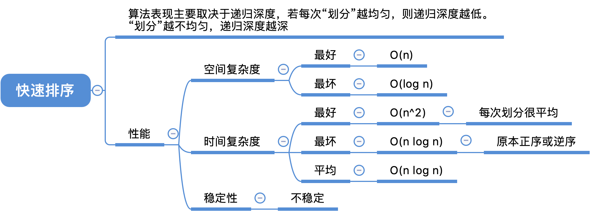

# 排序

### 快速排序




Partition 过程：将要排序的数据分成独立的两部分，其中一部分的所有数据都比另外一部分的所有数据都要小。快速排序整个排序过程可以递归进行，以此达到整个数据变成有序序列。

注：408原题中说，对所有尚未确定最终位置的所有元素进⾏⼀遍处理称为“⼀趟”排序，因此⼀次“划分”≠⼀趟排序。因此，⼀次 Partition 可以确定⼀个元素的最终位置，⽽⼀趟排序也许可以确定多个元素的最终位置。

<font color="red">**需要注意的是，严蔚敏和殷人昆给出了两种不同的快排方法。虽然两种方法均正确，但排序中间步骤得到的序列不同，导致做题时对答案产生疑惑。**</font>

#### 严蔚敏《数据结构》P274


```c
// 一趟快排
int Partition(SqList &L, int low, int high) {
    pivotkey = L[low];          //用字表的第一个记录记录枢轴的位置
    while (low < high) {
        while (low < high && L[high] > pivotkey) --high;    //将比枢轴记录小的记录移到低端
        L[low] = L[high];
        while (low < high && L[low] < pivotkey) ++low;
        L[high] = L[low];       //将比枢轴记录大的记录移到高端
    }
    L[low] = pivotkey;          //枢轴记录到位
    return low;                 //返回枢轴位置
}

// 快速排序算法
void Qsort(Sqlist &L, int low, int high) {
    if (low < high) {                           //长度大于1
        pivotloc = Partition(L, low, high);     //将L一分为2
        QSort(L, low, pivotloc - 1);            //对低子表递归排序，pivotloc是枢轴位置
        Qsort(L, pivotloc + 1, high);           //对高子表递归排序
    }
}
```

#### 殷人昆《数据结构》P406


```c
void Swap(int& a, int& b)
{
	int tmp = a;
	a = b;
	b = tmp;
}
 
int Partition(int V[], int low, int high)
{
	int privotpos = low;
	int privot = V[low];
	for(int i = low+1; i < high+1; ++i)
	{
		if(V[i] < privot)
		{
			privotpos++;
			if(privotpos != i)
			{
				Swap(V[privotpos],V[i]);
			}
		}
	}
	V[low] = V[privotpos];
	V[privotpos] = privot;
 
	return privotpos;
}
 
void QuickSort(int V[], const int left, const int right)
{
	if(left < right)
	{
		int privotpos = Partition(V, left, right);
		QuickSort(V,left, privotpos-1);
		QuickSort(V,privotpos+1, right);
	}
}
```

