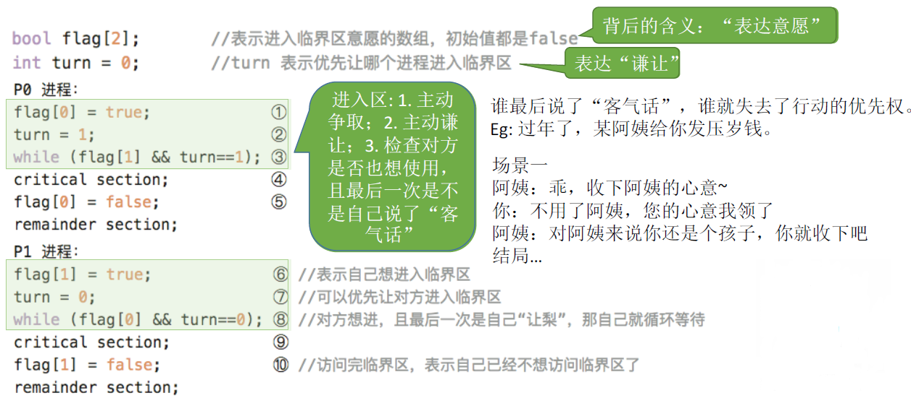
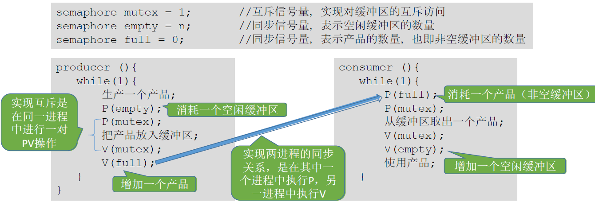

# 第二章 进程管理3 - 进程同步与互斥

### 什么是进程同步

知识点回顾：进程具有异步性的特征。异步性是指，各并发执行的进程以各自独立的、不可预知的速度向前推进。

由于并发必然导致异步性。而实际应用中，又必须按照某种顺序执行，如何解决这种异步问题，就是“进程同步”所讨论的内容。

**同步** 亦称直接 **制约关系**，它是指为完成某种任务而建立的两个或多个进程，这些进程因为需要在某些位置上 **协调它们的工作次序** 而产生的制约关系。

对临界资源的互斥访问，可以在逻辑上分为如下四个部分：


### 进程互斥的原则

为了实现对临界资源的互斥访问，同时保证系统整体性能，需要遵循以下原则：

1. **空闲让进**。临界区空闲时，可以允许一个请求进入临界区的进程立即进入临界区；
2. **忙则等待**。当已有进程进入临界区时，其他试图进入临界区的进程必须等待；
3. **有限等待**。对请求访问的进程，应保证能在有限时间内进入临界区（保证不会饥饿）；
4. **让权等待**。当进程不能进入临界区时，应立即释放处理机，防止进程忙等待。


### 进程互斥的软件实现方法

#### 1、单标志法

算法思想：两个进程在访问完临界区后会把使用临界区的权限转交给另一个进程。也就是说，每个进程进入临界区的权限只能被另一个进程赋予。

turn 的初值为 0，即刚开始只允许 0 号进程进入临界区。


该算法可以实现**同一时刻最多只允许一个进程访问临界区**，但是两个进程必须轮流访问。如果 P0 一直不访问临界区，虽然临界区空闲，但并不允许 P1 访问。**违背“空闲让进”原则**。

#### 2、双标志先检查法

算法思想：设置一个布尔型数组flag[]，数组中各个元素用来标记各进程想进入临界区的意愿，比如“flag[0] = ture”意味着0 号进程P0 现在想要进入临界区。每个进程在进入临界区之前先检查当前有没有别的进程想进入临界区，如果没有，则把自身对应的标志flag[i] 设为true，之后开始访问临界区。


由于进入区的“检查”和“上锁” 两个处理**不是一气呵成**的，**“检查”后、“上锁”前** 可能发生进程切换。

主要问题是：**违反“忙则等待”**原则，并发时可能导致两个进程同时访问临界区。

#### 3、双标志后检查法

先“上锁”后“检查”的方法，来避免上述问题。


若按照①⑤②⑥的顺序执行，P0 和 P1 将无法进入临界区。

此方法虽然 **解决了“忙则等待”** 的问题，但是又 **违背了“空闲让进”、“有限等待”原则**。

#### 4、Peterson 算法

算法思想：结合双标志法、单标志法的思想。如果双方都争着想进入临界区，那可以让进程尝试谦让

谁最后设置了 turn 的值，谁就失去了行动的优先权。




Peterson 算法用软件方法解决了进程互斥问题，**遵循了空闲让进、忙则等待、有限等待**三个原则，但是依然**未遵循让权等待**的原则（进程无法获得使用权的时候，一直while循环检测，消耗CPU资源）。

Peterson 算法相较于之前三种软件解决方案来说是最好的，但依然不够好。


### 进程互斥的硬件实现方法

#### 1、中断屏蔽方法

与原语的实现思想相同，即在某进程开始访问临界区到结束访问为止，都不允许被中断。

```java
开中断;
临界区;
关中断;
```

优点：

- 简单，高效

缺点：

- 不适用于多处理机
- 由于开/关中断指令是特权指令，只能运行在内核态，因此只适用于内核级进程，不适用于用户级进程

#### 2、TestAndSetLock 指令

TSL 是 Test and Set Lock 的缩写。要实现 TSL 需要硬件的支持。

硬件指令：

```asm
TSL RX, LOCK # 测试并加锁
```

该指令所做的事情：

- 读取 Lock 的值，存入寄存器RX中
- 给 Lock 设置一个非0值（设置到LOCK对应的内存中）

以上三个步骤是一个 **不可拆分** 的原子操作，执行该指令的CPU将会 **锁住内存总线**（memory bus），以禁止其他CPU在本指令结束之前访问内存。

##### TSL和中断屏蔽的区别

当一个CPU将中断屏蔽后，只影响当前屏蔽中断的CPU，其他CPU还是依然可以照样访问内存的（想要中断）。唯一一个当一个CPU在访问内存时阻止其他CPU访问内存的方法就是将内存总线锁住，这个需要硬件的支持，TSL可以达到该目的。

##### 利用TSL完成进程间互斥 - 《现代操作系统》P71

```asm
enter_region:
    TSL REGISTER, LOCK                    /*复制锁到寄存器并将锁置1*/
    CMP REGISTER, #0                      /*判断寄存器内容是否为0*/
    JNE enter_region                      /*若不是0，说明锁已经被设置，跳转到enter_region循环*/
    RET                                   /*返回调用者，进入临界区*/

leave_region:
    MOVE LOCK, #0                         /*在锁中置0*/
    RET                                   /*返回调用者*/
```

1. 如果LOCK的值为0，则将LOCK的值设置为1，且进入临界区
2. 如果LOCK的值为1，则一直循环等待
3. 如果多个进程同时调用TSL，利用TSL的特性：只有一个进程访问，其他的会被block

（下图图源王道）


#### 3、XCHG 指令

一个可替换 TSL 的指令是 XCHG，它原子性地交换了两个位置的内容。它本质上与 TSL 的解决方法一样。

```asm
enter_region:
    MOVE REGISTER, #1                       /*给寄存器中置1*/
    XCHG REGISTER, LOCK                     /*交换寄存器与锁变量的内容*/
    CMP REGISTER, #0                        /*判断寄存器内容是否为0？*/
    JNE enter_region                        /*若不是0跳转到enter_region*/
    RET                                     /*返回调用者，进入临界区*/
leave_region:
    MOVE LOCK, #0                           /*在锁中置0*/
    RET                                     /*返回调用者*/
```

优点：

- 使用硬件方式实现简单；适用于多处理机环境

缺点：

- 不满足“让权等待”原则，暂时无法进入临界区的进程会占用 CPU 资源并循环执行 TSL 指令，导致忙等


### 信号量机制

以上所有方案都无法实现让权等待，而信号量机制实现了让权等待。

用户进程通过使用操作系统提供的**一对原语**来对信号量进行操作，实现了进程互斥、进程同步。

- P 操作：申请 / wait(S) / P(S)

- V 操作：释放 / signal(S) / V(S)

#### 1、整型信号量

用一个 **整数型的变量** 作为信号量，表示系统中某种资源的数量。对信号量的三种操作：

- 初始化
- P 操作（将“检查”和“上锁”一气呵成，避免并发 / 异步导致的问题）
- V 操作

存在的问题：不满足“让权等待”原则，会发生“忙等”，一直 while 占用处理机

#### 2、记录型信号量（默认）

##### 记录型信号量定义

S.value 表示系统中某种资源的数目。


##### P 操作（wait 操作）

对信号量 S 执行一次 P 操作，即执行 S.value--，表示资源数减 1

若 S.value < 0 时，该资源已分配完毕，进程调用 block 原语自我阻塞（运行态 -> 阻塞态），主动放弃处理机，并插入该类资源的等待队列 S.L 中。遵循了“让权等待”原则。


##### V 操作（signal 操作）

对信号量 S 执行一次 V 操作，即执行 S.value++，表示资源数加 1

若 S.value <= 0，仍有进程在等待资源，则调用 wakeup 原语唤醒等待队列中第一个进程（阻塞态 -> 就绪态）


#### 信号量机制实现进程互斥

1. 分析并发进程的关键活动，划定临界区（如：对临界资源打印机的访问就应放在临界区）
2. 设置互斥信号量 mutex，初值为 1
3. 在进入区 P(mutex)——申请资源
4. 在退出区 V(mutex)——释放资源


#### 信号量机制实现进程同步 - 前 V 后 P

1. 分析什么地方需要实现“同步关系”，即必须保证“一前一后”执行的两个操作
2. 设置同步信号量 S, 初始为 0
3. 在“前操作”之后执行 V(S)
4. 在“后操作”之前执行 P(S)

P2 需要这种资源，而只有 P1 才能产生这种资源。即，只有执行了 V 操作之后，P 操作之后的代码才会执行。


#### 信号量机制实现前驱关系 - 前 V 后 P

进程P1 中有句代码S1，P2 中有句代码S2 ，P3中有句代码S3 …… P6 中有句代码S6。这些代码要求按如下前驱图所示的顺序来执行：


其实每一对前驱关系都是一个进程同步问题（需要保证一前一后的操作）因此，
1. 要为每一对前驱关系各设置一个同步信号量
2. 在“前操作”之后对相应的同步信号量执行V 操作
3. 在“后操作”之前对相应的同步信号量执行P 操作


### 生产者 - 消费者问题

生产者、消费者共享一个初始为空、大小为n的缓冲区。缓冲区是临界资源，各进程必须互斥地访问。

- 若缓冲区 **不满**，生产者可以 **生产**  ->  **V(full) 释放**

- 若缓冲区 **非空**，消费者可以 **消费**  ->  **P(full) 申请**


仍然满足 **前 V 后 P**：consumer 需要这种资源，而只有 producer 才能产生这种资源。即，只有执行了 V(full) 操作之后，P(full) 操作之后的代码才会执行。




```java
semaphore mutex = 1; 	// 互斥信号量，实现对缓冲区的互斥访问
semaphore empty = n; 	// 同步信号量，表示空闲缓冲区的数量
semaphore full = 0; 	// 同步信号量，表示产品的数量，也即非空缓冲区的数量

producer (){			// 生产者
    while(1){
        生产一个产品;
        P(empty);		// 实现互斥的 P 操作必须在实现同步的 P 操作之后，否则会导致死锁
        P(mutex);
        把产品放入缓冲区;
        V(mutex);		// 可以改变相邻 V 操作的顺序
        V(full);
    }
}

consumer (){			// 消费者
    while(1){
        P(full);
        P(mutex);
        从缓冲区取出一个产品;
        V(mutex);
        V(empty);
        使用产品;
    }
}
```


### 多生产者 - 多消费者问题

桌上有一盘子，每次只能放入一个水果。爸爸只放苹果，妈妈只放橘子，儿子只吃橘子，女儿只吃苹果。

盘子空才能放，盘子有正确的水果才能取。用 PV 操作实现上述过程。

生产者生产的产品、消费者消费的产品类别各不相同。

##### 分析同步关系（一前一后）：

1. 父亲将苹果放入盘子后，女儿才能取苹果
2. 母亲将橘子放入盘子后，儿子才能取橘子
3. 只有盘子为空时，父亲或母亲才能放入水果


> 总结：在生产者-消费者问题中，如果缓冲区大小为1，那么有可能不需要设置互斥信号量就可以实现互斥访问缓冲区的功能。这不是绝对的，要具体问题具体分析。
>
> 建议：在考试中如果来不及仔细分析，可以加上互斥信号量，保证各进程一定会互斥地访问缓冲区。但需要注意的是，**实现互斥的 P 操作一定要在实现同步的 P 操作之后**，否则可能引起“死锁”。

##### 代码

```java
// semaphore mutex = 1; // 实现互斥访问盘子（缓冲区）
semaphore apple = 0; 	// 盘子中有几个苹果
semaphore orange = 0; 	// 盘子中有几个橘子
semaphore plate = 1; 	// 盘子中还可以放多少个水果
dad (){
    while(1){
        准备一个苹果;
        P(plate);		// P 申请盘子里的一个空位
        把苹果放入盘子;
        V(apple);		// V 释放一个苹果
    }
}
mom (){
    while(1){
        准备一个橘子;
        P(plate);
        把橘子放入盘子;
        V(orange);
    }
}
daughter (){
    while(1){
        P(apple);		// P 申请一个苹果
        从盘中取出苹果;
        V(plate);		// V 释放盘子一个空位
        吃掉苹果;
    }
}
son(){
    while(1){
        P(orange);
        从盘中取出橘子;
        V(plate);
        吃掉橘子;
    }
}
```


### 吸烟者问题

#### 可以生产多个产品的单生产者问题

系统中有 **三个抽烟者进程**，每个抽烟者不断地卷烟并抽烟。抽烟者卷起并抽掉一颗烟需要有三种材料：烟草、纸、胶水。一个抽烟者有烟草，一个有纸，另一个有胶水。

系统中还有 **一个供应者进程**，它们无限地供应所有三种材料，但每次仅轮流提供三种材料中的两种。

得到缺失的两种材料的抽烟者在卷起并抽掉一颗烟后，会发信号通知供应者，让它继续提供另外的两种材料。这一过程重复进行。

请用以上介绍的 IPC 同步机制编程，实现该问题要求的功能。

#### 分析关系

桌子：容量为1的缓冲区，要互斥访问

##### 三种组合

1. 纸 + 胶水
2. 烟草 + 胶水
3. 烟草 + 纸

##### 同步关系（从事件角度分析）

1. 桌上有组合 1 -> 第 1 个抽烟者取走东西
2. 桌上有组合 2 -> 第 2 个抽烟者取走东西
3. 桌上有组合 3 -> 第 3 个抽烟者取走东西

发出完成信号 -> 供应者将下一个组合放到桌上


##### 代码

不需要设置一个专门的同步信号量。因为缓冲区大小为 1，故同一时刻，四个同步信号量中至多有一个为 1。

```java
semaphore offer1 = 0;	// 桌上组合一的数量
semaphore offer2 = 0; 	// 桌上组合二的数量
semaphore offer3 = 0; 	// 桌上组合三的数量
semaphore finish = 0; 	// 抽烟是否完成
int i = 0; 				// 用于实现“三个抽烟者轮流流抽烟”

provider (){
    while(1){
        if(i==0) {
        	将组合一放桌上;
        	V(offer1);
        } else if(i==1){
        	将组合二放桌上;
        	V(offer2);
        } else if(i==2){
        	将组合三放桌上;
        	V(offer3);
        }
        i = (i+1)%3;
        P(finish);
    }
}

smoker1 (){
    while(1){
        P(offer1);
        从桌上拿走组合一；卷烟；抽掉；
        V(finish);
    }
}

smoker2 (){
    while(1){
        P(offer2);
        从桌上拿走组合二；卷烟；抽掉；
        V(finish);
    }
}

smoker3 (){
    while(1){
        P(offer3);
        从桌上拿走组合三；卷烟；抽掉；
        V(finish);
    }
}
```


### 读者写者问题

有读者、写者两组并发进程，共享一个文件。规则：

- 允许 **多个读者** 同时 **读** 文件
- 只允许 **一个写者** 写文件
- **写完成** 之前 **不允许读**
- **读完成** 之前 **不允许写**

**互斥关系**

- 互斥：写 - 写 / 写 - 读

- 不互斥：读 - 读

##### 代码

```java
semaphore rw=1; 		// 用于实现对共享文件的互斥访问
int count = 0; 			// 记录当前有几个读者程在访问文件
semaphore mutex = 1; 	// 用于保证对count变量的互斥访问
semaphore w = 1; 		// 用于实现写优先

writer (){
    while(1){
        P(w);
        P(rw);
        写文件;
        V(rw);
        V(w);
    }
}

reader (){
    while(1){
        P(w);
        P(mutex);
        if(count==0){
            P(rw);
        }
        count++;
        V(mutex);
        V(w);
        读文件…
        P(mutex);
        count--;
        if(count==0){
            V(rw);
        }
        V(mutex);
    }
}
```


