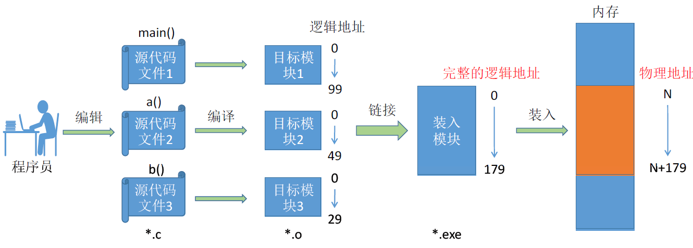
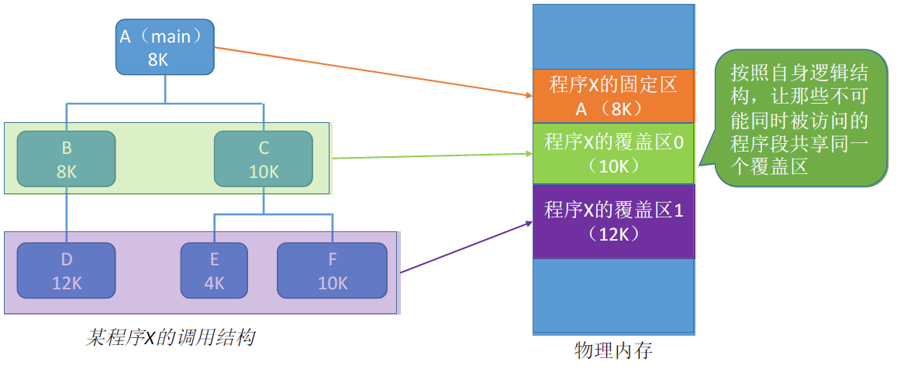
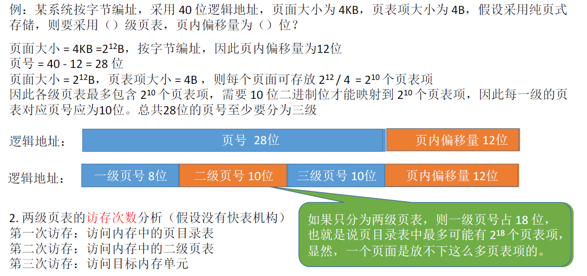
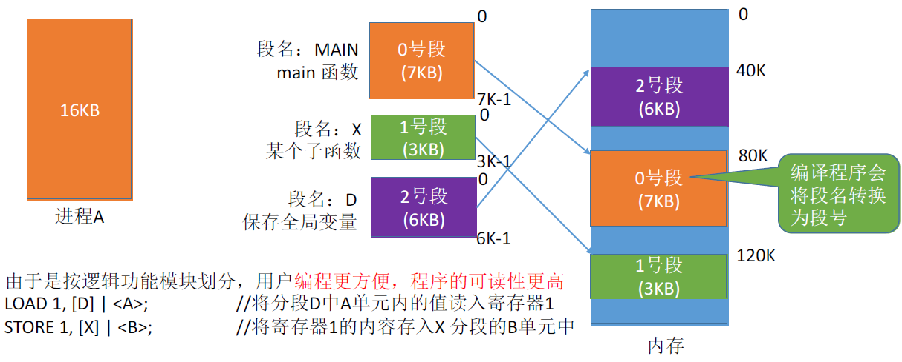
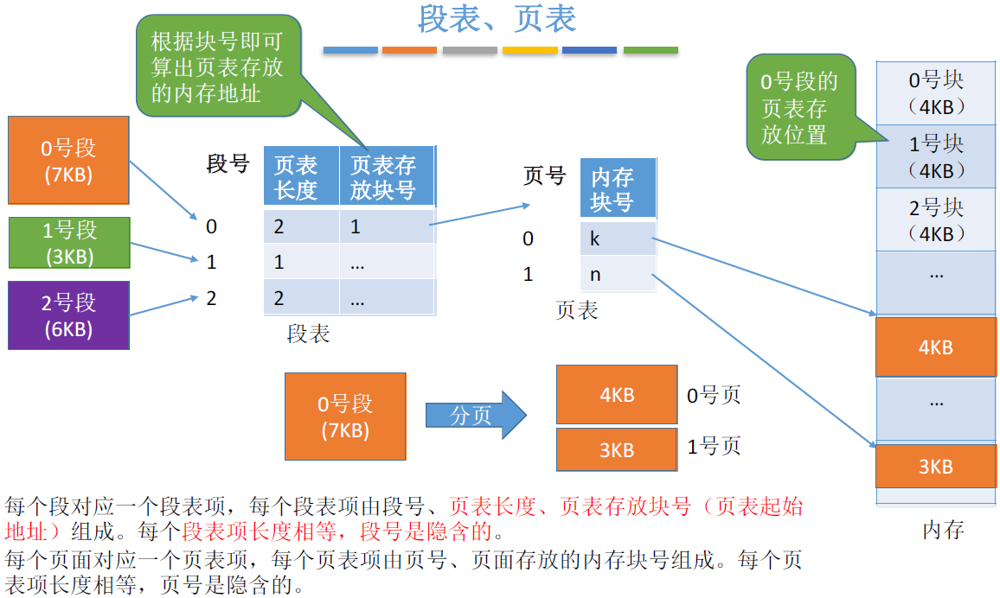

# 第三章 内存管理

## 基础知识

1 Byte（字节） = 8 bit

1 字 = 16 / 32 / ... bit，字由若干个字节构成，不同的机器有不同的字长。

> 2^10 = 1 K（千）
> 2^20 = 1 M（兆，百万）
> 2^30 = 1 G （十亿，百兆）

例如，4 GB = 4 * 2^30 bit = 2^32 bit

### 逻辑地址 / 物理地址

为了简化理解，本节中我们默认操作系统给进程分配的是一片连续的内存空间

#### 装入的三种方式

##### 1、绝对装入：编译时完成地址变换

- 编译时，如果知道程序将放到内存中的哪个位置，**编译程序** 将产生 **绝对地址** 的目标代码。
- 装入时，装入程序按照装入模块中的地址，将程序和数据装入内存。

特点：只适用于单道程序环境。

##### 2、静态重定位：装入时完成地址变换

- 编译、链接后的装入模块的地址都是 **从 0 开始** 的 **逻辑地址**。
- 装入时，根据内存的当前情况，对地址进行 **重定位**，将 **逻辑地址** 变换为 **物理地址**。

特点：一个作业装入内存时，必须分配其要求的全部内存空间，如果没有足够的内存，就不能装入该作业。作业一旦进入内存，在运行期间不能再移动，也不能再申请内存空间。

##### 3、动态重定位：运行时才进行地址变换表（普遍使用）

- 编译、链接后的装入模块的地址都是 **从 0 开始**。
- 执行时，才将 **逻辑地址** 转换为 **物理地址**。这种方式需要 **重定位寄存器** 的支持。

特点：允许程序在内存中发生移动。

#### 从写程序到程序运行

1. 编译：由编译程序将用户源代码编译成若干个目标模块（编译就是把高级语言翻译为机器语言）
2. 链接：由链接程序将编译后形成的一组目标模块，以及所需库函数链接在一起，形成一个完整的装入模块
3. 装入（装载）：由装入程序将装入模块装入内存运行

##### 链接的三种方式

1. 静态链接：程序运行之前，先将各目标模块及它们所需的库函数连接成一个完整的可执行文件（装入模块），之后不再拆开。
2. 装入时动态链接：将各目标模块装入内存时，边装入边链接。
3. 运行时动态链接：在程序执行中需要该目标模块时，才对它进行链接。便于修改、更新、共享模块。

## 内存管理

### 内存空间的分配与回收

#### 覆盖技术（只用于早期的操作系统）

思想：将程序分为多个段（多个模块）。常用的段常驻内存，不常用的段在需要时调入内存。

内存中分为一个 **固定区** 和若干 **覆盖区**。

- 常驻内存的段放在“固定区”中，运行过程中不再调出
- 不常用的段放在“覆盖区”，根据需要调入调出

由程序员声明覆盖结构，操作系统完成自动覆盖。对用户不透明，增加了用户编程负担。

#### 交换技术

内存紧张时，换出某些进程以腾出内存空间，再换入某些进程。进程的 PCB 需要常驻内存。

**中级调度** 就是要决定将哪个处于挂起状态的进程重新调入内存。

磁盘分为 **文件区** 和 **对换区**（swap分区），换出的进程放在对换区。

- 文件区：离散分配方式，空间利用率高
- 交换区：连续分配方式，IO 速度快

##### 覆盖与交换的区别

覆盖是在同一个程序 / 进程中的，交换是在不同进程 / 作业间的。

#### 连续分配管理方式

为用户进程分配的必须是一个连续的内存空间

##### 单一连续分配

支持单道程序，内存分为系统区 / 用户区

- 系统区：存放操作系统相关数据
- 用户区：存放用户进程相关数据。内存中只能有一道用户程序，独占整个用户区空间。

无外部碎片，有内部碎片

##### 固定分区分配

支持多道程序，内存用户空间分为若干个固定大小的分区，每个分区只能装一道作业

两种分区方式：分区大小相等 / 分区大小不等

分区说明表（可用数组 / 链表表示）

无外部碎片，有内部碎片

##### 动态分区分配

支持多道程序，在程序装入内存时，根据进程的大小动态地建立分区

无内部碎片，有外部碎片

回收内存分区时，可能遇到的四种情况：空间相邻的分区需要合并

- 回收区之后有相邻的空闲分区
- 回收区之前有相邻的空闲分区
- 回收区前后都有相邻的空闲分区
- 回收区前后都没有相邻的空闲分区

##### 动态分区分配算法 

两种常用的数据结构：空闲分区链 / 空闲分区表

| 算法     | 算法思想                                               | 分区排列顺序                                   | 优点                                                         | 缺点                                                         |
| -------- | ------------------------------------------------------ | ---------------------------------------------- | ------------------------------------------------------------ | ------------------------------------------------------------ |
| 首次适应 | **从头到尾**找适合的分区                               | 空闲分区以地址递增次序排列                     | 综合看性能最好。**算法开销小**，回收分区后一般不需要对空闲分区队列重新排序 | 低地址不断划分，产生很多小外部碎片，而每次从低地址开始找，增大了查找开销 |
| 最佳适应 | **优先使用更小的分区**，以保留更多大分区               | 空闲分区以容量递增次序排列                     | 会有更多的大分区被保留下来，更能满足大进程需求               | 会产生很多太小的、难以利用的碎片；**算法开销大**，回收分区后可能需要对空闲分区队列重新排序 |
| 最坏适应 | **优先使用更大的分区**，以防止产生太小的不可用的碎片   | 空闲分区以容量递减次序排列                     | 可以减少难以利用的小碎片                                     | 大分区容易被用完，不利于大进程；**算法开销大**（原因同上）   |
| 邻近适应 | 由首次适应演变而来，每次从**上次查找结束位置**开始查找 | 空闲分区以地址递增次序排列（可排列成循环链表） | 不用每次都从低地址的小分区开始检索。**算法开销小**（原因同首次适应算法） | 会使高地址的大分区先被用完                                   |

#### 非连续分配管理方式

##### 基本分页存储管理

###### 思想

- 把进程分页，各页面放入不同内存块中

###### 易混

- 页框 = 页帧 = 内存块 = 物理块 = 物理页面**（内存空间划分）** **VS** 页 = 页面**（进程逻辑空间划分）**
- 页框号 = 页帧号 = 内存块号 = 物理块号 = 物理页号 **VS** 页号 = 页面号
- **页面** 与 **页框** 是一一对应关系，使用 **页表** 记录这种对应关系

###### 页表（page frame）

- 页表记录 页面 -> 内存块 映射关系
- **一个进程对应一张页表**，进程每一页对应一个页表项（页号 + 块号）
- 页表项的大小相同。页号隐含，不占空间
- i 号页表项存放地址 = 页表地址 + i * 页表项大小

###### 逻辑地址结构

- 逻辑地址用 **页号、页内偏移量** 表示

  - 页号 = 逻辑地址 / 页面大小

  - 页内偏移量 = 逻辑地址 / 页面大小  -> 为何页面大小取 2 的整数次幂？类似于子网掩码方便二进制运算

    >假设物理地址也用32个二进制位表示，则由于内存块的大小=页面大小，因此：
    >
    >0号内存块的起始物理地址是 **00000000000000000000** 000000000000
    >1号内存块的起始物理地址是 **00000000000000000001** 000000000000
    >2号内存块的起始物理地址是 **00000000000000000010** 000000000000
    >3号内存块的起始物理地址是 **00000000000000000011** 000000000000
    >
    >假设通过查询页表得知1号页面存放的内存块号是9（1001），则9号内存块的起始地址= 9*4096 = 00000000000000001001000000000000，则逻辑地址4097对应的物理地址= 页面在内存中存放的起始地址+ 页内偏移量 =（00000000000000000011000000000001）
    >
    >即，如果页面大小刚好是2的整数幂，则只需把页**表中记录的物理块号**拼接上**页内偏移量**，就能得到对应的物理地址

###### 如何实现地址转换

1. 计算出逻辑地址的页号、页内偏移量
2. 找到对应页面在内存中的存放位置（查页表）
3. 物理地址 = 页面地址 + 页内偏移量

###### 基本地址变换机构

是用于实现 **逻辑地址** 到 **物理地址** 转换的一组硬件机构

页表寄存器存放 **页表起始地址、页表长度**

地址变换手算过程：

1. 计算页号、页内偏移量
2. 比较页号 P 和页表长度 M，若P≥M，则产生越界中断，否则继续执行（页号从0开始）
3. 页表项地址 = 页表起始地址F + 页号P * 页表项长度，取出该页表项内容b，即为内存块号
4. 计算E = b * L + W，用得到的物理地址E 去访存（若二进制，可直接拼接）

其他小细节

- 页内偏移量位数、页面大小之间可以互相计算
- 页式管理中地址是一维的
- 实际应用中，通常使一个页框恰好能放入整个页表项
- 为了方便找到页表项，页表一般是放在连续的内存块中的

###### 具有快表的地址变换机构

快表，又称联想寄存器（TLB, translation lookaside buffer），是一种高速缓存。由于程序的局部性原理，通过存放最近访问的页表项的副本，加快地址变换的速度。

对应地，内存中的页表常称为慢表。

引入快表前后的地址变换过程：

|                        | 地址变换过程                                                 | 访问一个逻辑地址的访存次数                      |
| ---------------------- | ------------------------------------------------------------ | ----------------------------------------------- |
| 基本地址变换机构       | ①算页号、页内偏移量 ②检查页号合法性 ③查页表，找到页面存放的内存块号 ④根据内存块号与页内偏移量得到物理地址 ⑤访问目标内存单元 | 两次访存                                        |
| 具有快表的地址变换机构 | ①算页号、页内偏移量 ②检查页号合法性 ③查快表。若**快表命中**，即可知道页面存放的内存块号，可直接进行⑤；若未命中，则进行④ ④查页表，找到页面存放的内存块号，并且将页表项复制到快表中 ⑤根据内存块号与页内偏移量得到物理地址 ⑥访问目标内存单元 | 快表命中，只需一次访存;快表未命中，需要两次访存 |

###### 两级页表

单级页表存在的问题：

- 所有页表项必须连续存放，页表过大时需要很大的连续空间
- 在一段时间内并非所有页面都用得到，因此没必要让整个页表常驻内存

两级页表：

- 将长长的页表再分页
- 逻辑地址结构：一级页号 / 二级页号 / 页内偏移量
- 注意几个术语：页目录表 / 外层页表 / 顶级页表

如何实现地址变换：

- 按照地址结构将逻辑地址拆分成三份
- 从 PCB 中读出页目录表起始地址，根据一级页号查询页目录表，找到下一级页表在内存中的存放位置
- 根据二级页表查表，找到最终想访问的内存号
- 结合业内偏移量得到物理地址

几个细节

- 多级页表中，各级页表的大小不能超过一个页面，若两级页表不够，可以分更多级
- 多级页表的访问次数（假设没有快表机构）：N 级页表访问一个逻辑地址需要 N+1 次访存

###### 例题

##### 基本分段存储管理

###### 分段

以段为单位进行分配，段内连续，段间可不相邻。

分段系统的逻辑地址结构由段号（段名）和段内地址（段内偏移量）所组成。

- **段号的位数** 决定了每个进程最多可以分几个段
- **段内地址位数** 决定了每个段的最大长度是多少

###### 段表

为了能从物理内存中找到各个逻辑段的存放位置，需为每个进程建立一张段映射表，称 **段表**。

各个段表项的长度是相同的。因此段号是隐含的，不占存储空间。

###### 地址变换

1. 根据逻辑地址得到段号、段内地址
2. 判断 **段号是否越界**。若 S ≥ M，则产生越界中断（段表长度至少是1，而段号从0开始）
3. 查询段表，找到对应的段表项，段表项的存放地址 = F + S * 段表项长度
4. 检查 **段内地址是否超过段长**（因为段长各不相同）。若 W ≥ C，则产生越界中断
5. 计算得到物理地址
6. 访问目标内存单元

###### 分段、分页管理的对比

- 页是物理单位。分页是系统管理，对用户不可见；地址空间是一维的。
- 段是逻辑单位。分段是用户需求，需要程序员指出段名。地址空间是二维的（段名 + 段内地址）

注：分段存储也可以引入快表机构。

##### 段页式存储管理

|          | 优点                                                 | 缺点                                                         |
| -------- | ---------------------------------------------------- | ------------------------------------------------------------ |
| 分页管理 | 内存空间利用率高，不会产生外部碎片，只有少量页内碎片 | 不方便按照逻辑模块实现信息的共享和保护                       |
| 分段管理 | 方便按照逻辑模块实现信息共享 / 保护                  | 如果段长过大，为其分配很大的连续空间会很不方便。段式管理会产生外部碎片。 |

段页式系统的逻辑地址结构由段号、页号、页内地址（页内偏移量）组成。

“分段”对用户是可见的，程序员编程时需要显式地给出段号、段内地址。而将各段“分页”对用户是不可见的。系统会根据段内地址自动划分页号和页内偏移量。因此段页式管理的地址结构是二维的。

- 段号的位数决定了每个进程最多可以分几个段
- 页号位数决定了每个段最大有多少页
- 页内偏移量决定了页面大小、内存块大小是多少

###### 地址变换

1. 由逻辑地址得到段号、页号、页内偏移量
2. 段号与段表寄存器中的段长度比较，检查是否越界
3. 由段表起始地址、段号，找到对应的段表项
4. 根据段表中记录的页表长度，检查页号是否越界
5. 由段表中的页表地址、页号得到查询页表，找到相应页表项
6. 由页面存放的内存块号、页内偏移量，得到最终物理地址
7. 访问目标单元

###### 访存次数

3 次访存。查段表、查页表、访问目标单元。可引入快表机构，由（段号+页号）直接找到目标地址，只需要一次访存。

### 内存空间的扩充

### 地址转换

### 存储保护